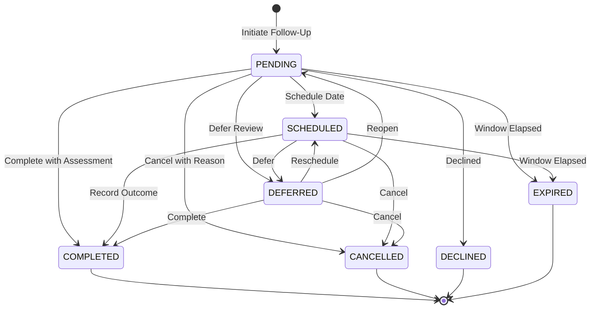

# Phase 41: Welfare Follow-Up, Outcome Tracking & Support Effectiveness

## 1. Executive Summary & Purpose

Phase 41 establishes the **closed-loop monitoring layer** for the ManoBal system. Following Phase 40 supportive welfare recommendations and Phase 37 interventions, Phase 41 provides authoritative tracking of:
1. **Follow-Up Requirements:** Was appropriate follow-up recommended or scheduled after a welfare concern or intervention?
2. **Follow-Up Lifecycle:** Controlled state machine tracking (`PENDING`, `SCHEDULED`, `COMPLETED`, `DEFERRED`, `DECLINED`, `CANCELLED`, `EXPIRED`).
3. **Objective Observational Outcomes:** Descriptive data observation comparing post-follow-up assessments with an explicit pre-follow-up baseline (`IMPROVED`, `STABLE`, `PERSISTENT_CONCERN`, `WORSENING`, `INSUFFICIENT_DATA`).

> [!IMPORTANT]
> **Core Architectural Principles:**
> - **No New Risk Score:** Phase 41 does NOT create an `outcome_score`, `effectiveness_score`, `recovery_score`, or any other secondary score.
> - **Authoritative Roles:** Phase 34 remains the sole authoritative risk engine; Phase 36 provides longitudinal analytics; Phase 37 manages interventions; Phase 39 identifies anomalies; Phase 40 provides decision support recommendations; Phase 41 observes closed-loop follow-up outcomes.
> - **Non-Clinical Boundary:** Phase 41 reports observable follow-up and outcome patterns from available welfare data. It does not establish clinical recovery, fitness for duty, treatment effectiveness, or personnel suitability.
> - **Temporal Integrity:** Pre-intervention baseline < Intervention / Recommendation creation <= Post-follow-up assessment.

---

## 2. Closed-Loop Target Architecture

```text
Assessment
    ↓
Phase 34 — Authoritative Risk Engine
    ↓
Phase 36 — Longitudinal Trend Intelligence
    ↓
Phase 37 — Welfare Alerts & Interventions
    ↓
Phase 39 — Early-Warning / Anomaly Detection
    ↓
Phase 40 — Support Recommendations
    ↓
Human Decision (Accept / Schedule)
    ↓
Supportive Intervention / Follow-up Action
    ↓
Phase 41 — Closed-Loop Follow-up & Outcome Tracking
    ↓
Subsequent Assessment & Trend Ingestion
    ↓
Human Review (Objective Observational State)
```

---

## 3. Data Model

### `WelfareFollowup` (`welfare_followups` table)
- `id`: Primary key.
- `personnel_id`: Foreign key to `Personnel` (indexed, cascade on delete).
- `recommendation_id`: Foreign key to `WelfareRecommendation` (SET NULL).
- `intervention_id`: Foreign key to `WelfareIntervention` (SET NULL).
- `alert_id`: Foreign key to `WelfareAlert` (SET NULL).
- `followup_type`: Follow-up classification:
  * `WELFARE_CHECKIN`: Follow-up after a welfare follow-up recommendation.
  * `RECOVERY_REVIEW`: Follow-up after workload/recovery recommendation.
  * `DUTY_SCHEDULE_REVIEW`: Follow-up after schedule/rotation support.
  * `SUPPORT_RESOURCE_FOLLOWUP`: Follow-up after support resources offered.
  * `REASSESSMENT`: Follow-up assessment after an earlier welfare concern.
  * `INTERVENTION_REVIEW`: Review after an existing Phase 37 intervention.
- `status`: Controlled lifecycle status (`PENDING`, `SCHEDULED`, `COMPLETED`, `DEFERRED`, `DECLINED`, `CANCELLED`, `EXPIRED`).
- `scheduled_at`: Scheduled date and time.
- `review_window`: Suggested review window derived from recommendation metadata or configuration (e.g., `"Within 7 days"`, `"Within 14 days"`, `"NOT_SPECIFIED"`).
- `due_date`: Derived datetime from review window. Flagged as `is_overdue = True` if `due_date < now` while in `PENDING` or `SCHEDULED`.
- `completed_at`: Timestamp of completion.
- `created_by` / `completed_by`: User ID of authorized officers.
- `notes`: Review notes and context.
- `outcome_status`: Observational outcome state (`IMPROVED`, `STABLE`, `PERSISTENT_CONCERN`, `WORSENING`, `INSUFFICIENT_DATA`).
- `baseline_source`: Explicit source label (`PRE_INTERVENTION_ASSESSMENT`, `PRE_RECOMMENDATION_ASSESSMENT`, `HISTORICAL_BASELINE`).
- `baseline_assessment_id`: ID of baseline `StressAssessment`.
- `followup_assessment_id`: ID of subsequent post-follow-up `StressAssessment`.
- `evidence_json`: Structured explainable evidence dictionary with score deltas, data sufficiency, and non-clinical notice.

### `WelfareFollowupAudit` (`welfare_followup_audits` table)
Tracks every state transition and lifecycle event:
- Actions: `FOLLOWUP_CREATED`, `FOLLOWUP_SCHEDULED`, `FOLLOWUP_DEFERRED`, `FOLLOWUP_COMPLETED`, `FOLLOWUP_CANCELLED`, `OUTCOME_RECORDED`, `OUTCOME_REASSESSED`.
- Records: `actor_id`, `previous_status`, `new_status`, `timestamp`, `metadata_json`.

---

## 4. Lifecycle State Machine



---

## 5. Baseline Selection & Temporal Integrity

To prevent accidental comparison of mismatched time periods or using pre-intervention assessments as evidence of outcome, Phase 41 enforces:

1. **Explicit Baseline Anchor:**
   - Evaluates the creation time of the linked recommendation, intervention, or follow-up (`anchor_time`).
   - Baseline assessment MUST satisfy: `assessment_timestamp <= anchor_time`.
2. **Subsequent Assessment Ordering:**
   - Follow-up assessment MUST satisfy: `followup_timestamp > baseline_timestamp` (and `>= anchor_time`).
   - If an out-of-order assessment is supplied, the system explicitly raises `ValueError` ("Temporal integrity violation").

---

## 6. Deterministic Outcome Classification Logic

Comparing post-follow-up assessment $A_{post}$ with baseline $A_{base}$:
$$\Delta = \text{risk\_score}(A_{post}) - \text{risk\_score}(A_{base})$$

1. **`IMPROVED`**:
   - $\Delta \le -5.0$ points (meaningful improvement threshold established in Phase 36).
2. **`WORSENING`**:
   - $\Delta \ge +5.0$ points (meaningful deterioration threshold established in Phase 36).
3. **`PERSISTENT_CONCERN`**:
   - $|\Delta| < 5.0$ points, AND baseline risk score $\ge 55.0$ (Elevated, High, or Critical) with subsequent risk score remaining $\ge 55.0$.
4. **`STABLE`**:
   - $|\Delta| < 5.0$ points without persistent elevated strain.
5. **`INSUFFICIENT_DATA`**:
   - Post-follow-up assessment missing, or score contains `None`/`NaN`/`Inf`.

---

## 7. Integration with Other Phases

- **Phase 34 (Risk Engine):** Phase 41 directly consumes authoritative risk scores and categories; it never generates independent scores.
- **Phase 36 (Longitudinal Intelligence):** Outcome delta thresholds ($\pm 5.0$) match Phase 36's validated slope and trajectory criteria.
- **Phase 37 (Welfare Interventions):** Follow-ups link to `intervention_id`, but preserve independent state. An intervention being `COMPLETED` and a follow-up recording `STABLE` are separate facts.
- **Phase 40 (Support Recommendations):** When a follow-up completion records `WORSENING` or `PERSISTENT_CONCERN`, the system surfaces this finding to the authorized reviewer and can trigger `WelfareRecommendationService.evaluate_and_generate_recommendations(...)` to produce a fresh supportive recommendation.

---

## 8. Security, RBAC & Privacy

1. **Anti-IDOR Protection:**
   - Personnel / Jawans can only query their own follow-up records (`user.personnel_id == personnel_id`). Any cross-personnel query raises HTTP 403 Forbidden.
2. **Organizational Scoping:**
   - Officers and Welfare staff are strictly scoped to matching `battalion` and `location`.
3. **Privacy Threshold (k-Anonymity):**
   - Commander analytics enforce `ANALYTICS_MIN_GROUP_SIZE = 5`. If the population in scope is less than 5, unit-level outcome distributions and metrics are suppressed (`data_suppressed = True`).
   - No personnel performance ranking or "best/worst" lists are generated.
