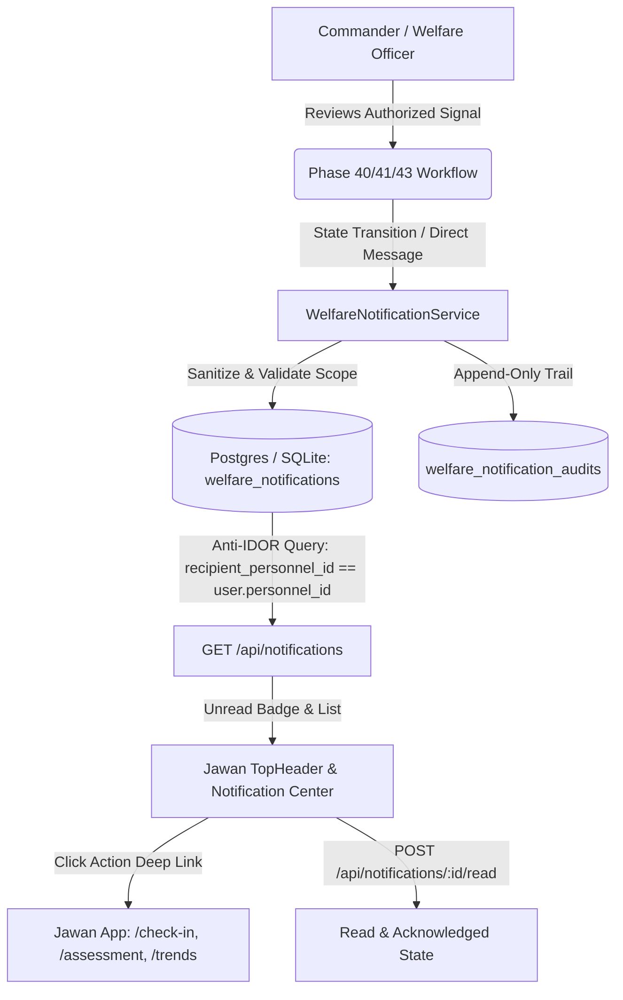

# Phase 47: Jawan Welfare Notifications & Commander-to-Personnel Signal Delivery

**Date:** September 2026  
**Status:** Completed & Validated  
**Module:** `welfare_notification_service`, `WelfareNotification`, `WelfareNotificationAudit`, Jawan Notification Center & Commander Signal Delivery  

---

## 1. Executive Summary & Objective

In prior phases (Phases 34–46), the ManoBal system established an authoritative ML stress prediction engine (Phase 34 LightGBM with TreeSHAP), operational alerts (Phase 37), anomaly detection (Phase 39), supportive recommendations (Phase 40), follow-up tracking (Phase 41), and structured human-review case workspaces (Phase 43).

However, while commanders and welfare officers could acknowledge, plan, and action these welfare signals, the corresponding supportive communication did **not** reach the affected soldier in the Jawan application.

**Phase 47 closes this critical loop** by implementing an end-to-end, privacy-preserving, anti-IDOR compliant notification pipeline:
1. **Authoritative Workflow Hooks:** Automated generation of supportive notifications when recommendations are accepted, follow-ups are scheduled/reminded, or cases/requests are updated.
2. **Direct Commander-to-Jawan Welfare Signaling:** Authorized commanders and welfare officers can dispatch direct, non-punitive welfare messages with action deep links (`/check-in`, `/assessment`, `/trends`).
3. **Jawan Notification Center & Drawer:** Real-time unread badges in navigation, prominent "Welfare Updates" dashboard card, and dedicated notification center drawer with 1-click read/mark-all and deep linking.
4. **Zero Risk Engine Duplication:** Reuses existing Phase 34, 37, 39, 40, 41, and 43 data architectures without creating secondary risk or alert engines.
5. **Strict Anti-IDOR & Privacy Guardrails:** Jawans can **never** access another soldier's notifications, and internal ML scores/SHAP/jargon are prevented from leaking into Jawan-facing communications.

---

## 2. Architecture & Data Model

### Data Flow

### Database Schema

#### `welfare_notifications`
- `id`: Integer Primary Key, indexed
- `recipient_personnel_id`: Foreign Key (`personnel.id`), indexed, cascading delete
- `notification_type`: String(64) (`WELFARE_SUPPORT`, `FOLLOW_UP_REQUEST`, `FOLLOW_UP_REMINDER`, `SUPPORT_RECOMMENDATION`, `DUTY_SUPPORT_REVIEW`, `RECOVERY_SUPPORT`, `CASE_UPDATE`, `WELFARE_MESSAGE`)
- `title`: String(256), sanitized
- `message`: Text, sanitized (no internal ML jargon, max 1000 characters)
- `source_type`: String(64) (`RECOMMENDATION`, `FOLLOWUP`, `ALERT`, `CASE`, `COMMANDER_ACTION`, `WELFARE_REQUEST`)
- `source_id`: Integer, nullable
- `priority`: String(16) (`INFO`, `STANDARD`, `PRIORITY`, `URGENT`)
- `action_url`: String(256) (relative safe deep link)
- `status`: String(32) (`UNREAD`, `READ`, `ACKNOWLEDGED`, `DISMISSED`)
- `created_at`: DateTime(timezone=True)
- `read_at`: DateTime(timezone=True), nullable
- `acknowledged_at`: DateTime(timezone=True), nullable
- `created_by`: Foreign Key (`users.id`), nullable
- `metadata_json`: Text (contextual payload)

#### `welfare_notification_audits`
- `id`: Integer Primary Key
- `notification_id`: Foreign Key (`welfare_notifications.id`), cascading delete
- `action`: String(64) (`NOTIFICATION_CREATED`, `NOTIFICATION_READ`, `NOTIFICATION_ACKNOWLEDGED`, `NOTIFICATION_DISMISSED`)
- `actor_id`: Foreign Key (`users.id`), nullable
- `previous_status`: String(32)
- `new_status`: String(32)
- `timestamp`: DateTime(timezone=True)
- `metadata_json`: Text

---

## 3. APIs Created & Endpoints

| Method | Endpoint | Authorization | Description |
| :--- | :--- | :--- | :--- |
| `GET` | `/api/notifications` | Authenticated | Lists notifications. Jawans only see own; Officers see unit scope. |
| `GET` | `/api/notifications/unread-count` | Authenticated | Returns `{ unread_count: int }` for authenticated user. |
| `GET` | `/api/notifications/{id}` | Authenticated | Detail of notification. Enforces Anti-IDOR (403 on mismatch). |
| `POST` | `/api/notifications/{id}/read` | Authenticated | Marks notification as `READ` and logs audit entry. |
| `POST` | `/api/notifications/read-all` | Personnel | Marks all pending unread notifications as `READ`. |
| `POST` | `/api/notifications/send` | Admin / Officer / Welfare | Authorized creation of notification within battalion scope. |

---

## 4. Security & Privacy Protections

1. **Anti-IDOR Enforcement:**
   - Jawan A cannot view Jawan B's notifications via list (`?personnel_id=X` is rejected with `HTTP 403 Forbidden`).
   - Jawan A cannot fetch Jawan B's notification by ID (`HTTP 403 Forbidden`).
   - Jawan A cannot mark Jawan B's notification as read (`HTTP 403 Forbidden`).
2. **Organizational Scope Boundaries:**
   - Officers can only notify personnel belonging to their assigned Battalion and Location.
   - Out-of-scope dispatch attempts are rejected with `HTTP 403 Forbidden`.
3. **ML Jargon & Non-Stigmatizing Filtering:**
   - Automated regex and sanitizer neutralizes internal analytical terms (`Isolation Forest`, `SHAP value`, `anomaly score is`, `2.8σ`) to ensure messages are supportive and non-punitive.
4. **Anti-Injection:**
   - HTML and script tags are strictly escaped with `html.escape`.

---

## 5. UI/UX Implementations

### Jawan Mobile Web App (`PS 26186_app`)
- **TopHeader:** Notification Bell icon with pulsating emerald unread badge (`unreadCount > 0`).
- **Notification Drawer:** Glassmorphism overlay with category pills, time-ago, supportive body, action CTA button, and single/all mark-as-read buttons.
- **HomeScreen:** "Welfare Updates" banner displayed below greeting for immediate 1-tap attention.
- **Deep Linking:** 1-tap navigation directly to `/check-in`, `/assessment`, or `/trends`.

### Commander / Welfare Officer Dashboard (`PS 26186`)
- **Personnel Detail View (`/personnel/[id]`):** "Notify Personnel" button in header action toolbar.
- **Support Recommendations Panel:** "Notify Jawan" button on every recommendation card.
- **Send Welfare Notification Modal:** Preset templates (Check-in Requested, Support Resources Available, Follow-up Scheduled, Recovery Guidance, Custom), character counter, priority selector, and deep link target selector.

---

## 6. Verification & Test Results

1. **Phase 47 Dedicated Test Suite (`tests/test_phase47_notifications.py`):**
   - `test_commander_can_send_welfare_notification` (PASSED)
   - `test_jawan_can_view_own_notifications` (PASSED)
   - `test_jawan_can_get_unread_count` (PASSED)
   - `test_jawan_can_mark_notification_as_read` (PASSED)
   - `test_jawan_mark_all_as_read` (PASSED)
   - `test_jawan_cannot_access_another_jawans_notification` (PASSED)
   - `test_commander_cannot_send_notification_out_of_scope` (PASSED)
   - `test_sensitive_ml_jargon_is_sanitized_from_jawan_notifications` (PASSED)
   - `test_automatic_notification_on_recommendation_accepted` (PASSED)
   - `test_automatic_notification_on_followup_scheduled` (PASSED)
   - `test_audit_logs_exist_for_notification_events` (PASSED)
   - **Result:** `11 passed in 10.67s`

2. **Regression Test Suite (Phases 34, 37, 40, 41, 43):**
   - **Result:** `96 passed in 16.51s`
   - Zero breaking changes to risk calibration, alert lifecycles, or case management.

3. **TypeScript & Production Builds:**
   - Jawan App (`PS 26186_app`): `npx tsc --noEmit` (0 errors), `npm run build` (PASSED)
   - Commander Dashboard (`PS 26186`): `npx tsc --noEmit` (0 errors), `npm run build` (PASSED)

4. **Live End-to-End Execution:**
   - Officer sent notification -> persisted in DB -> Jawan received -> Unread count = 1 -> Jawan marked read -> Unread count = 0 -> All verified live on localhost:8000, localhost:3000, localhost:3001.
