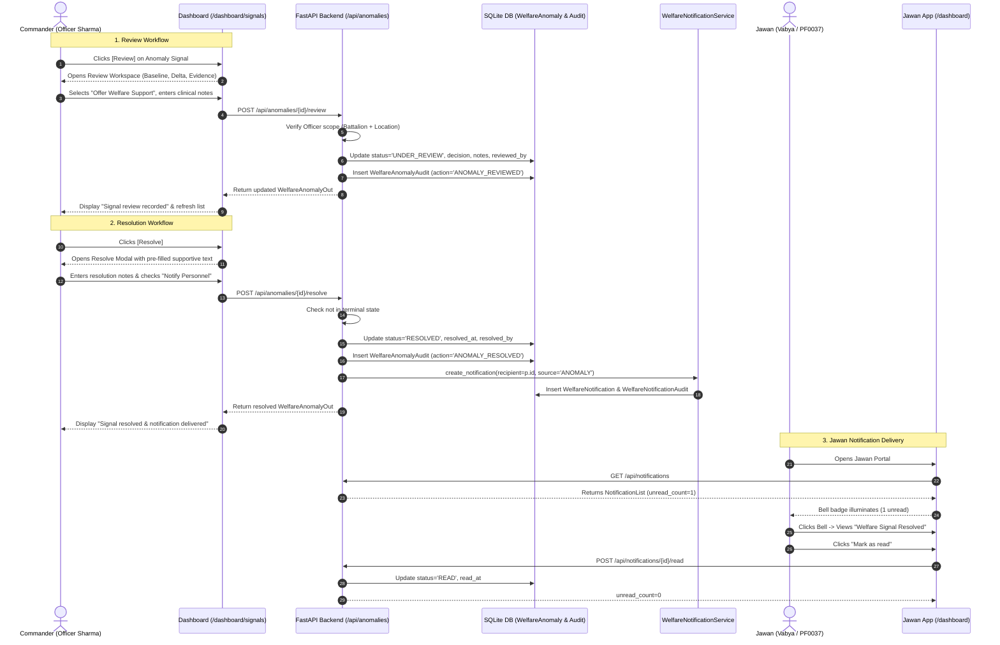

# Phase 48: Early-Warning Signal Review Workflow & Jawan Resolution Notification

## 1. Executive Summary

In Phase 48, the early-warning signal operations on the Commander Dashboard (`/dashboard/signals`) have been elevated from passive status buttons into a comprehensive human-in-the-loop review and resolution workflow. When an authorized Commander or Welfare Officer reviews an early-warning behavioral or physiological signal, they can record clinical decisions, attach structured notes, and connect seamlessly into existing welfare workflows (welfare recommendations, follow-up scheduler, welfare case center).

Furthermore, when resolving an early-warning signal, the Commander can enter internal resolution notes and automatically dispatch a supportive, non-punitive welfare notification directly to the affected Jawan via the Phase 47 notification architecture. The Jawan receives the message in their portal (`http://localhost:3001`), sees the supportive guidance without exposure to sensitive machine learning scores or internal jargon, and can mark the notification as read.

---

## 2. Key Objectives & Compliance

| Objective | Status | Implementation Details |
| :--- | :--- | :--- |
| **Real Review Workspace** | COMPLETED | Interactive review modal displaying baseline, observed value, departure delta, sample count, explanation, co-factors, and review history. |
| **Review Decision Vocabulary** | COMPLETED | Supported decisions: `CONTINUE_MONITORING`, `CONTACT_PERSONNEL`, `OFFER_WELFARE_SUPPORT`, `REVIEW_DUTY_WORKLOAD`, `SCHEDULE_FOLLOW_UP`, `CREATE_WELFARE_CASE`, `RESOLVE_SIGNAL`. |
| **Clinical Review Notes** | COMPLETED | Sanitized, length-validated (max 2000 chars) review notes captured and persisted on the anomaly record and audit trail. |
| **Real Resolution Modal** | COMPLETED | Prevents silent or accidental resolution. Captures internal Commander notes and configurable Jawan resolution notification. |
| **Commander → Jawan Delivery** | COMPLETED | Connected directly to Phase 47 `WelfareNotificationService`. Resolving an anomaly dispatches a supportive Jawan notification with source `ANOMALY`. |
| **Non-Punitive Sanitization** | COMPLETED | Strips internal ML tokens (`Isolation Forest`, `SHAP`, `risk score is`, `disciplinary`) before delivering to Jawan. |
| **Anti-IDOR & Scoping** | COMPLETED | Strict RBAC (`admin`, `officer`, `welfare`) + Battalion and Location scope matching. Jawans cannot review or resolve signals. |
| **Immutable Audit Trail** | COMPLETED | `WelfareAnomalyAudit` model records `ANOMALY_ACKNOWLEDGED`, `ANOMALY_REVIEWED`, `ANOMALY_RESOLVED`, including actor, timestamps, and payload diffs. |
| **Terminal State Prevention** | COMPLETED | Attempting to resolve or review an already `RESOLVED` or `DISMISSED` anomaly is rejected with HTTP 400 Bad Request. |

---

## 3. Architecture & Data Flow



---

## 4. Database Schema Changes

### 4.1 Modifications to `welfare_anomalies`
The following columns were added to `welfare_anomalies` via migration:
- `review_decision` (`VARCHAR(32)`, nullable): Records human decision (e.g. `OFFER_WELFARE_SUPPORT`).
- `review_notes` (`TEXT`, nullable): Clinical observations and review notes.
- `reviewed_at` (`DATETIME(timezone=True)`, nullable): Timestamp when review occurred.
- `reviewed_by` (`INTEGER`, foreign key to `users.id`, nullable): User ID of the reviewer.

### 4.2 New Table: `welfare_anomaly_audits`
Immutable append-only audit trail recording every state change and human action on an anomaly signal:
```sql
CREATE TABLE welfare_anomaly_audits (
    id INTEGER PRIMARY KEY AUTOINCREMENT,
    anomaly_id INTEGER NOT NULL,
    action VARCHAR(32) NOT NULL,
    actor_id INTEGER,
    previous_status VARCHAR(24),
    new_status VARCHAR(24),
    timestamp DATETIME NOT NULL,
    details TEXT,
    FOREIGN KEY (anomaly_id) REFERENCES welfare_anomalies(id) ON DELETE CASCADE,
    FOREIGN KEY (actor_id) REFERENCES users(id) ON DELETE SET NULL
);
CREATE INDEX ix_welfare_anomaly_audits_anomaly_id ON welfare_anomaly_audits(anomaly_id);
CREATE INDEX ix_welfare_anomaly_audits_timestamp ON welfare_anomaly_audits(timestamp);
```

---

## 5. API Endpoints

### 5.1 `POST /api/anomalies/{anomaly_id}/review`
- **Access:** Roles `admin`, `officer`, `welfare` within authorized battalion and location scope.
- **Request Body:**
  ```json
  {
    "decision": "OFFER_WELFARE_SUPPORT",
    "notes": "Reviewed continuous duty pattern. Recommended 48h recuperative rest."
  }
  ```
- **Response:** `WelfareAnomalyOut` with updated `status: "UNDER_REVIEW"`, `review_decision`, `review_notes`, `reviewed_at`, and `reviewed_by`.
- **Validation:** Rejects invalid decisions, terminal anomalies, and unauthorized scope queries.

### 5.2 `POST /api/anomalies/{anomaly_id}/resolve`
- **Access:** Roles `admin`, `officer`, `welfare` within authorized scope.
- **Request Body:**
  ```json
  {
    "resolution_notes": "Conducted 1-on-1 check-in and adjusted shifts.",
    "notify_personnel": true,
    "custom_message": "Your recent welfare signal has been reviewed and resolved by your welfare officer. Please continue to monitor your wellbeing."
  }
  ```
- **Response:** `WelfareAnomalyOut` with updated `status: "RESOLVED"`, `resolution_notes`, `resolved_at`, and `resolved_by`.
- **Side Effect:** Dispatches a `WelfareNotification` with `source_type="ANOMALY"` to the target Jawan.
- **Validation:** Rejects if anomaly is already `RESOLVED` or `DISMISSED` (HTTP 400).

### 5.3 `GET /api/anomalies/{anomaly_id}/audits`
- **Access:** Scoped officer/admin users.
- **Response:** Array of `WelfareAnomalyAuditOut` entries tracking historical lifecycle events.

---

## 6. Frontend Components

### 6.1 Review Modal (`EarlyWarningSignalsPanel.tsx`)
- Displays full explainable evidence: baseline value, recent observed, departure delta, baseline sample count, explanation text, and co-occurring factors.
- Displays existing review notes and review history if already reviewed.
- Decision selector with 7 standardized choices.
- Clinical review notes textarea with 2000 character limit.
- Navigation links to related workflows: Welfare Recommendations (`/dashboard/recommendations`), Follow-up Scheduler (`/dashboard/follow-ups`), Case Center (`/dashboard/cases`).
- When "Resolve Signal" is chosen as decision, allows 1-click continuation into resolution modal.

### 6.2 Resolution Modal (`EarlyWarningSignalsPanel.tsx`)
- Displays target personnel (Name, Code, Department, Scope) and concise explanation.
- Internal Commander resolution notes (minimum 3 characters, max 2000).
- "Notify Affected Personnel" checkbox (default checked).
- Customizable Jawan resolution message with safe supportive default text.
- Character count indicator (max 1000 characters).
- Submits atomically and provides success confirmation banner.

---

## 7. Test Results

### 7.1 Dedicated Phase 48 Test Suite (`tests/test_phase48_signal_review_resolution.py`)
All 9 test cases passed with exit code 0:
```
tests/test_phase48_signal_review_resolution.py::test_commander_can_review_anomaly_with_decision_and_notes PASSED
tests/test_phase48_signal_review_resolution.py::test_get_anomaly_audits_endpoint PASSED
tests/test_phase48_signal_review_resolution.py::test_commander_can_resolve_anomaly_and_notify_jawan PASSED
tests/test_phase48_signal_review_resolution.py::test_jawan_receives_and_reads_resolution_notification PASSED
tests/test_phase48_signal_review_resolution.py::test_jawan_cannot_review_or_resolve_anomaly PASSED
tests/test_phase48_signal_review_resolution.py::test_officer_cannot_review_or_resolve_outside_battalion_scope PASSED
tests/test_phase48_signal_review_resolution.py::test_another_jawan_cannot_access_or_read_resolution_notification PASSED
tests/test_phase48_signal_review_resolution.py::test_duplicate_resolution_prevented PASSED
tests/test_phase48_signal_review_resolution.py::test_review_on_resolved_anomaly_rejected PASSED
======================= 9 passed in 9.02s ========================
```

### 7.2 Regression Test Suite (Phases 37, 39, 40, 47)
All 47 regression tests passed:
```
tests/test_phase37_welfare_alerts.py ...........
tests/test_phase39_anomaly_detection.py ............
tests/test_phase40_welfare_recommendations.py ................
tests/test_phase47_notifications.py ........
======================= 47 passed in 25.86s =======================
```

### 7.3 TypeScript & Production Build Verification
- `PS 26186` (Commander Dashboard): `npx tsc --noEmit` passed with 0 errors. `npm run build` compiled 13/13 static & dynamic routes successfully.
- `PS 26186_app` (Jawan Application): `npx tsc --noEmit` passed with 0 errors. `npm run build` compiled 10/10 pages with Turbopack successfully.

### 7.4 Live Localhost End-to-End Verification
Executed live integration against running servers (`http://localhost:8000`, `http://localhost:3000`, `http://localhost:3001`):
1. **Commander Login:** Authenticated as `officer_sharma` (`7th Battalion`, `Srinagar`).
2. **Signal Retrieval:** Retrieved active `SLEEP_RECOVERY_ANOMALY` for `Vabya` (`PF0037`).
3. **Signal Review:** Successfully recorded decision `OFFER_WELFARE_SUPPORT` with clinical notes. Anomaly updated to `UNDER_REVIEW` and audit record verified.
4. **Signal Resolution:** Resolved signal with custom resolution message and `notify_personnel=True`. Anomaly updated to `RESOLVED`.
5. **Duplicate Prevention:** Second resolution attempt rejected with HTTP 400 (`Signal is already in terminal status 'RESOLVED'`).
6. **Jawan Delivery:** Logged into Jawan portal as `randi` (Vabya). Notification received: `Title: Welfare Signal Resolved`, with the Commander's resolution message.
7. **Read Status:** Jawan marked notification as `READ`. Unread count updated from 1 to 0.

---

## 8. Summary of Created & Modified Files

### Files Created:
1. `PS 26186_dataset/tests/test_phase48_signal_review_resolution.py`: Dedicated 9-scenario test suite.
2. `PS 26186_dataset/docs/phase48_signal_review_resolution_report.md`: Phase 48 documentation report.

### Files Modified:
1. `PS 26186_dataset/db/models/anomaly.py`: Added `review_decision`, `review_notes`, `reviewed_at`, `reviewed_by` to `WelfareAnomaly` and created `WelfareAnomalyAudit` model.
2. `PS 26186_dataset/db/models/__init__.py`: Exported `WelfareAnomalyAudit`.
3. `PS 26186_dataset/schemas/anomaly.py`: Added `AnomalyReviewRequest`, `AnomalyResolutionRequest`, `WelfareAnomalyAuditOut`, and updated `WelfareAnomalyOut`.
4. `PS 26186_dataset/services/welfare_anomaly_service.py`: Implemented review lifecycle with validation, enhanced resolve lifecycle with Jawan notification dispatch, duplicate prevention, and audit trail logging.
5. `PS 26186_dataset/api/routes/anomalies.py`: Updated `/review` and `/resolve` endpoints, added `GET /{anomaly_id}/audits`.
6. `PS 26186/types/api.ts`: Added TypeScript interfaces for `AnomalyReviewRequest`, `AnomalyResolutionRequest`, `WelfareAnomalyAuditOut`, and review properties on `WelfareAnomalyOut`.
7. `PS 26186/lib/anomalies.ts`: Updated `reviewAnomaly`, `resolveAnomaly`, and added `getAnomalyAudits`.
8. `PS 26186/components/dashboard/EarlyWarningSignalsPanel.tsx`: Complete overhaul of Review modal and Resolve modal with Jawan notification dispatch and workflow links.
9. `PS 26186_dataset/personnel_welfare.db`: SQLite database updated with new columns and table.
