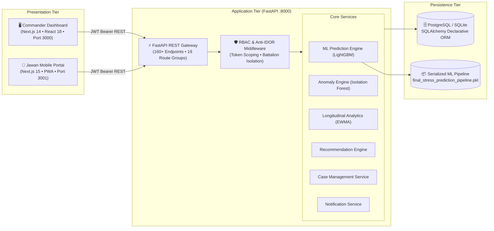

# ManoBal 🛡️ — Personnel Stress & Welfare Monitoring System

<div align="center">


**AI-Driven Early Warning, Longitudinal Welfare Intelligence & Human-in-the-Loop Decision Support for Defense & Uniformed Services**

[](https://opensource.org/licenses/MIT)
[](https://www.python.org/)
[](https://fastapi.tiangolo.com/)
[](https://nextjs.org/)
[](https://www.typescriptlang.org/)
[](https://tailwindcss.com/)
[](https://lightgbm.readthedocs.io/)
[](https://www.docker.com/)
[](https://github.com/Vabya/ManoBal)

[Live Deployments](#-live-deployments--quick-access) • [Key Features](#-key-features) • [System Architecture](#-system-architecture) • [AI/ML Engine](#-aiml-architecture--risk-scoring) • [Quickstart](#-installation--quickstart) • [API Reference](#-api-architecture--endpoints) • [Demo Walkthrough](#-live-demo-walkthrough)

---

</div>

## 🌐 Live Deployments & Quick Access

Access the live cloud deployments or launch locally:

| Portal | Target User | Live Cloud URL | Local Port | Key Capabilities |
| :--- | :--- | :--- | :---: | :--- |
| 🖥️ **Commander & Welfare Web Portal** | Battalion/Company Commanders, Welfare Officers, Counselors | [**Open Commander Portal**](https://manobal-commander.vercel.app) | `http://localhost:3000` | Real-time Unit Heatmaps, Early Warning Signals, Anomaly Detection, Case Management Workspace, Rest Stand-Down Approvals |
| 📱 **Jawan Welfare Mobile Portal (PWA)** | Jawans, Soldiers, Field Personnel | [**Open Jawan App**](https://manobal-jawan.vercel.app) | `http://localhost:3001` | 14-Screen Touch Assessment, Mood Check-ins, Longitudinal Stress Graph, Confidential Support Requests, Offline PWA |
| ⚡ **FastAPI ML Backend & Docs** | Developers, Integrators, Security Auditors | [**View Swagger API Docs**](https://manobal-api.onrender.com/docs) | `http://localhost:8000/docs` | Calibrated LightGBM Inference, Isolation Forest Anomaly Detection, SHAP Feature Attribution, Anti-IDOR RBAC |

> 🔗 **Official GitHub Repository:** [https://github.com/Vabya/ManoBal](https://github.com/Vabya/ManoBal)

---

### 🔑 Pre-Seeded Demo Credentials

The system includes pre-configured testing accounts with distinct role-based permissions:

| Role | Username | Password | Assigned Scope / Battalion | Target Application |
| :--- | :--- | :--- | :--- | :--- |
| 🎖️ **Jawan (Field Personnel)** | `jawan_verma` | `PersonnelPassword123!` | Personnel ID `4` (Delhi Unit) | Jawan Mobile Portal (`:3001`) |
| 🛡️ **Battalion Commander** | `officer_sharma` | `OfficerPassword123!` | 7th Battalion (Srinagar) | Commander Portal (`:3000`) |
| 🩺 **Welfare Officer / Counselor** | `counselor_priya` | `WelfarePassword123!` | Clinical Welfare Support Queue | Commander Portal (`:3000`) |
| ⚙️ **System Administrator** | `admin` | `AdminPassword123!` | Full Enterprise Scope | Commander Portal (`:3000`) |

---

## 📑 Table of Contents

- [1. Executive Overview](#1-executive-overview)
- [2. Problem Statement & The Proactive Shift](#2-problem-statement--the-proactive-shift)
- [3. End-to-End System Pipeline](#3-end-to-end-system-pipeline)
- [4. Key Features](#4-key-features)
  - [4.1 Jawan Self-Assessment Mobile Portal](#41-jawan-self-assessment-mobile-portal-ps-26186-app)
  - [4.2 Commander Operational & Welfare Dashboard](#42-commander-operational--welfare-dashboard-ps-26186)
  - [4.3 Human-in-the-Loop Case Management](#43-human-in-the-loop-case-management)
  - [4.4 Jawan Welfare Notification Delivery](#44-jawan-welfare-notification-delivery)
- [5. System Architecture](#5-system-architecture)
- [6. AI/ML Architecture & Risk Scoring](#6-aiml-architecture--risk-scoring)
  - [6.1 Calibrated LightGBM Risk Engine](#61-calibrated-lightgbm-risk-engine)
  - [6.2 Unsupervised Anomaly Detection (Isolation Forest)](#62-unsupervised-anomaly-detection-isolation-forest)
  - [6.3 Explainable AI (SHAP Attribution)](#63-explainable-ai-shap-attribution)
  - [6.4 Longitudinal Trajectory & Velocity Analysis](#64-longitudinal-trajectory--velocity-analysis)
- [7. Input Data Dictionary](#7-input-data-dictionary)
- [8. Security, Anti-IDOR & Ethical Privacy Guarantees](#8-security-anti-idor--ethical-privacy-guarantees)
- [9. Repository Structure](#9-repository-structure)
- [10. Installation & Quickstart](#10-installation--quickstart)
  - [Option A: Docker Compose (One-Command Launch)](#option-a-docker-compose-one-command-launch)
  - [Option B: Bare-Metal Local Development](#option-b-bare-metal-local-development)
- [11. API Architecture & Endpoints](#11-api-architecture--endpoints)
- [12. Live Demo Walkthrough](#12-live-demo-walkthrough)
- [13. Verification, Testing & Quality Assurance](#13-verification-testing--quality-assurance)
- [14. Known Limitations & Future Scope](#14-known-limitations--future-scope)
- [15. License & Team](#15-license--team)

---

## 1. Executive Overview

**ManoBal** (Hindi for *"Mental Strength"* / *"Inner Morale"*) is an enterprise-grade AI decision-support platform engineered specifically for **Central Armed Police Forces (CAPFs), Armed Forces, and Uniformed Personnel**.

Military and tactical environments expose soldiers to intense, compounded operational stressors: prolonged field deployments, high-tempo night rotations, severe sleep debt, isolation in forward posts, and delayed rotational leave. Traditional mental health approaches are **reactive**—interventions occur only after critical decompensation, disciplinary issues, or acute psychological crises arise.

ManoBal transforms defense mental health into a **proactive, preventive, and dignified welfare paradigm**. By fusing continuous operational telemetry (duty hours, shift patterns, leave gaps) with voluntary subjective check-ins and recovery metrics, ManoBal calculates continuous risk trajectories ($\Delta S / \Delta t$) and flags anomalies **weeks before clinical crisis occurs**.

```
PROACTIVE PARADIGM COMPARISON:
Traditional Military:  Critical Crisis Event ──────► Disciplinary Action or Emergency Medical Evac (Reactive)
ManoBal Paradigm:      Duty Spike + Sleep Debt ────► AI Detects Trend Velocity ──► 48h Rest Stand-Down (Preventive)
```

---

## 2. Problem Statement & The Proactive Shift

### The Operational Challenge in Defense
1. **Compound Operational Stressors:** Forward deployments without decompression windows, severe circadian rhythm disruption from irregular guard duties, and leave backlogs exceeding 180+ days.
2. **The Stigma Barrier:** Fear of career repercussions or loss of weapon clearance prevents jawans from self-reporting psychological distress.
3. **Information Silos:** Roster managers, commanders, and medical officers operate in isolated silos, leaving operational strain undetected until severe burnout occurs.

### ManoBal’s Core Principles
- **Multi-Factor Objective Grounding:** Integrates verified operational strain indicators (duty hours, night shifts, consecutive days on duty) with subjective check-ins so detection never relies solely on self-reporting.
- **Strict Non-Punitive Design:** No leaderboards, no individual public rankings, and zero automated disciplinary actions. Assessments are strictly confidential.
- **Human-in-the-Loop Governance:** AI provides evidence-based suggestions (such as a 48-hour rest stand-down or schedule rebalancing), but all final decisions require authenticated human review by an authorized commander or welfare officer.

---

## 3. End-to-End System Pipeline

The system transforms multi-source inputs into auditable human welfare actions:

```mermaid
flowchart TD
    subgraph DataIngestion ["1. Multi-Source Ingestion"]
        A1["📱 Voluntary Jawan Check-In<br>(Port 3001 • Touch UI)"]
        A2["📋 HRMS Duty Records<br>(Duty Hours, Night Shifts, Leave Gaps)"]
        A3["⌚ Telemetry Ingestion<br>(Sleep Hours, Resting HR, HRV RMSSD)"]
    end

    subgraph Validation ["2. Defense-Grade Shielding"]
        B["🛡️ Pydantic V2 Validation & Sanitization<br>(Rejects NaN, Inf, Injections, Negative Values)"]
    end

    subgraph IntelligenceCore ["3. AI & Behavioral Analytics"]
        C1["🤖 LightGBM Calibrated Model<br>(Continuous Risk Score 0–100)"]
        C2["🌲 Isolation Forest Outlier Engine<br>(Cohort Statistical Divergence)"]
        C3["📈 Longitudinal EWMA Engine<br>(Velocity ΔS/Δt • Improving/Worsening)"]
        C4["🔍 SHAP TreeExplainer<br>(Attribution & Risk Driver Extraction)"]
    end

    subgraph DecisionSupport ["4. Welfare Decision Support"]
        D1["🚨 Multi-Tier Early Warning Alerts<br>(High Stress Spike, Rapid Worsening)"]
        D2["💡 Evidence-Based Recommendations<br>(Rest Stand-Down, Schedule Review, Fast-track Leave)"]
    end

    subgraph HumanReview ["5. Human-in-the-Loop Workspace"]
        E1["👨‍✈️ Commander Unit Dashboard<br>(Port 3000 • Aggregated Heatmaps)"]
        E2["🩺 Welfare Case Workspace<br>(OPEN → REVIEW → RESOLVED Lifecycle)"]
        E3["📬 Targeted Jawan Notifications<br>(Supportive Non-Stigmatizing Guidance)"]
    end

    subgraph Audit ["6. Outcome & Compliance"]
        F1["📊 Longitudinal Follow-up Delta<br>(Pre vs. Post Intervention Outcome)"]
        F2["🔒 Tamper-Evident Audit Logging<br>(Immutable Case & Notification Logs)"]
    end

    DataIngestion --> Validation
    Validation --> IntelligenceCore
    IntelligenceCore --> DecisionSupport
    DecisionSupport --> HumanReview
    HumanReview --> Audit
```



---

## 4. Key Features

### 4.1 Jawan Self-Assessment Mobile Portal (`ps-26186-app`)
- **14-Screen Interactive Wizard:** Touch-optimized rating controls for duty hours, night shifts, sleep duration, physical fatigue, and morale.
- **Immediate Calibrated Feedback:** Provides transparent, supportive guidance and self-care recommendations without stigmatization.
- **Personal Trend Graph:** Interactive 7-day, 30-day, and 90-day personal stress trajectory graphs.
- **Welfare Notification Center:** Direct, confidential channel for updates, rest stand-down notices, and follow-up reminders.
- **Anti-IDOR Isolation:** Strict token-level isolation prevents jawans from accessing any peer records or commander views.

### 4.2 Commander Operational & Welfare Dashboard (`ps-26186`)
- **Unit Welfare Overview:** Real-time summary cards, stress distributions, active personnel metrics, and unit risk indexes.
- **Early Warning Signals Panel:** Urgency-badged alerts (`HIGH_STRESS_SPIKE`, `WORSENING_TREND`, `PROLONGED_DEPLOYMENT`).
- **Anomaly Detection Panel:** Cohort outlier heatmaps with plain-English SHAP attribution factor bars.
- **Support Recommendations Engine:** Context-aware intervention suggestions (48-hour rest stand-down, schedule review, leave approval).
- **Unit Privacy Protection:** Enforces $k \ge 5$ k-anonymity on all aggregate cohort views to prevent deanonymization.

### 4.3 Human-in-the-Loop Case Management
- **Structured Lifecycle:** Cases progress strictly through validated states (`OPEN` $\rightarrow$ `UNDER_REVIEW` $\rightarrow$ `SUPPORT_IN_PROGRESS` $\rightarrow$ `AWAITING_FOLLOW_UP` $\rightarrow$ `MONITORING` $\rightarrow$ `RESOLVED` $\rightarrow$ `CLOSED`).
- **Immutable Clinical Notes:** Append-only review logs with author timestamping.
- **Outcome Tracking:** Tracks pre- and post-intervention stress deltas ($\Delta S$) at 7, 14, and 30-day milestones.

### 4.4 Jawan Welfare Notification Delivery
- **Direct Support Channel:** Enables officers to securely transmit approved recommendations and follow-up requests directly to the affected Jawan.
- **Non-Stigmatizing Sanitization:** Technical commander-only metrics (raw risk numbers, anomaly sigmas, SHAP scores) are shielded from Jawan-facing notifications.
- **Tamper-Evident Auditing:** Every notification creation, delivery, and acknowledgment is permanently logged in `welfare_notification_audits`.

---

## 5. System Architecture

ManoBal uses a decoupled, three-tier architecture:



---

## 6. AI/ML Architecture & Risk Scoring

### 6.1 Calibrated LightGBM Risk Engine
- **Champion Artifact:** `PS 26186_dataset/ml_pipeline/models/final_stress_prediction_pipeline.pkl`
- **Model Pipeline:** LightGBM Gradient Boosted Trees combined with Scikit-Learn preprocessing (median imputation, one-hot encoding, min-max scaling).
- **Isotonic Probability Calibration:** Calibrated against out-of-fold validation sets to ensure predicted probabilities match empirical stress frequencies.
- **Continuous Score Mapping:** Computes an exact $0.0 - 100.0$ continuous risk score mapped to 4 operational tiers:
  - **Low ($0.0 - 34.9$):** Normal operational resilience. Standard duty rotations.
  - **Medium ($35.0 - 64.9$):** Moderate strain. Monitor consecutive shifts and encourage recovery.
  - **High ($65.0 - 84.9$):** Elevated operational fatigue. Active review; recommend 48h rest stand-down.
  - **Very High ($85.0 - 100.0$):** Acute compound overload. Immediate welfare intervention & fast-track leave.

### 6.2 Unsupervised Anomaly Detection (Isolation Forest)
Complementing supervised risk prediction, an unsupervised **Isolation Forest** ($n=100$) detects multidimensional cohort divergence—such as a soldier reporting normal duty hours but exhibiting sudden physiological collapse or extreme mood shifts.

### 6.3 Explainable AI (SHAP Attribution)
Using **SHAP TreeExplainer**, the system extracts feature attributions for every prediction, converting complex decision trees into human-interpretable risk drivers:
- `Elevated duty schedule: 72 hrs/week (+18.4 pts)`
- `Restricted restorative sleep: 4.5 hrs/night (+14.2 pts)`
- `Extended continuous duty: 16 consecutive days (+11.8 pts)`

### 6.4 Longitudinal Trajectory & Velocity Analysis
- **EWMA Smoothing:** Applies Exponentially Weighted Moving Averages ($\alpha = 0.3$) across multi-assessment histories.
- **Risk Velocity ($\Delta S / \Delta t$):** Evaluates rate of change over time. A rapid climb from 25 to 55 within 7 days triggers an early warning alert before standard critical thresholds are breached.

---

## 7. Input Data Dictionary

| Parameter | Domain Category | Data Type | Permitted Range | Source | Primary Usage |
| :--- | :--- | :---: | :---: | :--- | :--- |
| `duty_hours_per_week` | Operational | Float | $0.0 - 168.0$ | Assessment / HRMS | LightGBM Model, Duty Pacing Rules |
| `consecutive_duty_days` | Operational | Integer | $0 - 365$ | Assessment / HRMS | Fatigue Index, Anomaly Detection |
| `night_shifts_per_month` | Operational | Integer | $0 - 31$ | Assessment / HRMS | Circadian Disruption Calculation |
| `leave_gap_days` | Operational | Integer | $0 - 1000$ | Assessment / HRMS | Leave Deficit Metric, Fast-Track Rules |
| `deployment_days` | Operational | Integer | $0 - 2000$ | HRMS Sync / Seed | Cumulative Exposure Multiplier |
| `sleep_hours` | Recovery | Float | $0.0 - 24.0$ | Assessment / Telemetry | Sleep Deficit Calculation |
| `mood_score` | Wellbeing | Integer | $1 - 5$ | Check-in Wizard | Subjective Morale Factor |
| `burnout_symptoms` | Wellbeing | String | `Rarely`, `Sometimes`, `Often` | Assessment Wizard | Burnout Penalty Multiplier |
| `heart_rate` | Physiological | Integer | $30 - 220$ | Telemetry Ingestion | Autonomic Anomaly Detection |
| `hrv_rmssd` | Physiological | Float | $5.0 - 250.0$ | Telemetry Ingestion | Parasympathetic Recovery Vitals |

---

## 8. Security, Anti-IDOR & Ethical Privacy Guarantees

### Role-Based Access Control (RBAC) Matrix

| Capability / Resource | Jawan (`personnel`) | Commander (`officer`) | Counselor (`welfare`) | System Admin (`admin`) |
| :--- | :---: | :---: | :---: | :---: |
| Submit Own Assessment | ✅ | ❌ | ❌ | ❌ |
| View Own Stress Trends | ✅ | ❌ | ❌ | ❌ |
| View Unit Dashboard | ❌ (403) | ✅ (Unit Scoped) | ✅ (Unit Scoped) | ✅ (Global) |
| Access Welfare Alerts | ❌ (403) | ✅ (Unit Scoped) | ✅ (Unit Scoped) | ✅ (Global) |
| Create Welfare Case | ❌ (403) | ✅ (Unit Scoped) | ✅ (Unit Scoped) | ✅ (Global) |
| Send Supportive Notification | ❌ (403) | ✅ (Unit Scoped) | ✅ (Unit Scoped) | ✅ (Global) |
| Access Cross-Location Data | ❌ (403) | ❌ (403) | ❌ (403) | ✅ (Global) |

### Anti-IDOR Verification Proof
When Officer Sharma (`officer_sharma`, assigned to `7th Battalion, Srinagar`) attempts to inspect a personnel record in `Delhi`, the API immediately rejects the request:
```json
HTTP/1.1 403 Forbidden
{
  "detail": "Cross-location access restricted. Officer location 'Srinagar' does not match personnel location 'Delhi'."
}
```

---

## 9. Repository Structure

```
ManoBal/
├── README.md                           # Master Technical & Deployment Documentation
├── docker-compose.yml                  # Full-stack multi-container deployment
├── .env.example                        # Standardized environment configuration template
│
├── PS 26186_dataset/                   # ⚡ FastAPI ML Backend & Welfare Intelligence Engine
│   ├── api/
│   │   ├── routes/                     # 19 REST route modules (auth, assess, alerts, cases, notifs)
│   │   ├── deps.py                     # JWT token validation, RBAC, Anti-IDOR guards
│   │   └── main.py                     # FastAPI application factory & CORS configuration
│   ├── core/                           # Security, config settings, logging
│   ├── db/                             # SQLAlchemy ORM models, session & database seeders
│   ├── ml_pipeline/                    # LightGBM training pipelines & serialized artifacts
│   ├── schemas/                        # Pydantic v2 validation & response schemas
│   ├── services/                       # Business logic (Prediction, Anomaly, Cases, Notifications)
│   ├── tests/                          # 35 Pytest files (450+ tests covering entire lifecycle)
│   └── requirements.txt                # Backend dependencies (FastAPI, LightGBM, SHAP, PyTorch)
│
├── ps-26186/                           # 🖥️ Commander & Welfare Web Dashboard
│   ├── app/                            # Next.js App Router (/dashboard, /personnel, /login)
│   ├── components/                     # Modular UI panels (Alerts, Heatmaps, Recommendations, Cases)
│   ├── lib/                            # API client, RBAC context, dashboard data fetchers
│   └── package.json                    # Next.js 14, React 18, TailwindCSS, Recharts, Lucide
│
└── ps-26186-app/                       # 📱 Jawan Mobile Self-Assessment Portal (PWA)
    ├── app/                            # Next.js App Router ((tabs), /assessment, /trends, /checkin)
    ├── components/                     # Mobile-first touch sliders, notification drawers, headers
    ├── lib/                            # Mobile API client, auth state, notification handlers
    └── package.json                    # Next.js 15, Turbopack, TailwindCSS
```

---

## 10. Installation & Quickstart

### Option A: Docker Compose (One-Command Launch)

The fastest way to launch the entire ecosystem locally:

```bash
# 1. Clone repository
git clone https://github.com/Vabya/ManoBal.git
cd ManoBal

# 2. Configure environment
cp .env.example .env

# 3. Build and launch all services
docker compose up --build
```

All 3 applications will be available immediately:
- 🖥️ **Commander Portal:** `http://localhost:3000`
- 📱 **Jawan Mobile Portal:** `http://localhost:3001`
- ⚡ **Backend API & Docs:** `http://localhost:8000/docs`

---

### Option B: Bare-Metal Local Development

#### Prerequisites
- **Python:** 3.10, 3.11, or 3.12
- **Node.js:** 18.18+ or 20+
- **Git**

#### Step 1: Start Backend API (`PS 26186_dataset`)
```bash
cd "PS 26186_dataset"

# Create and activate virtual environment
python -m venv venv
# On Windows:
venv\Scripts\activate
# On Linux/macOS:
source venv/bin/activate

# Install dependencies and initialize database
pip install -r requirements.txt
python -m db.init_db

# Start FastAPI server
uvicorn api.main:app --host 0.0.0.0 --port 8000 --reload
```
*API running at `http://localhost:8000` • Swagger Docs at `http://localhost:8000/docs`*

#### Step 2: Start Commander Dashboard (`ps-26186`)
In a second terminal:
```bash
cd "ps-26186"
npm install
npm run dev
```
*Dashboard running at `http://localhost:3000`*

#### Step 3: Start Jawan Mobile Portal (`ps-26186-app`)
In a third terminal:
```bash
cd "ps-26186-app"
npm install
npm run dev -- -p 3001
```
*Mobile Portal running at `http://localhost:3001`*

---

## 11. API Architecture & Endpoints

FastAPI backend registers **160+ endpoints across 19 route modules** (`http://localhost:8000/docs`):

```bash
# Sample: Test Live Prediction via cURL
curl -X POST "http://localhost:8000/api/predict" \
     -H "Content-Type: application/json" \
     -d '{
       "age": 29,
       "gender": "Male",
       "location": "Srinagar",
       "job_role": "Field Officer",
       "department": "Operations",
       "experience_years": 5.0,
       "duty_hours_per_week": 72.0,
       "sleep_hours": 4.5,
       "consecutive_duty_days": 16,
       "night_shifts_per_month": 12,
       "leave_gap_days": 105,
       "burnout_symptoms": "Often",
       "remote_posting": "Yes",
       "operational_exposure": "High"
     }'
```

### Sample Inference Response
```json
{
  "risk_score": 80.8,
  "stress_level": "High",
  "risk_priority": "Priority",
  "confidence": "High",
  "risk_trend": "Worsening",
  "key_factors": [
    "Elevated duty schedule: 72 hrs/week",
    "Restricted restorative sleep: 4.5 hrs/night",
    "Extended continuous duty: 16 consecutive days",
    "High night-shift frequency: 12 shifts/month"
  ],
  "recommendations": [
    {
      "recommendation_type": "Rest Stand-Down",
      "recommendation_text": "Immediate 48-hour operational rest stand-down and welfare review.",
      "priority": "Urgent"
    }
  ]
}
```

---

## 12. Live Demo Walkthrough

1. **Jawan Self-Assessment:**
   - Log into `http://localhost:3001` as `jawan_verma` (`PersonnelPassword123!`).
   - Complete the 14-screen interactive wizard with 72 duty hours and 4.5h sleep.
   - Observe the instant calibrated result and non-stigmatizing self-care guidance.
2. **Automated Signal Synthesis:**
   - The backend computes an updated EWMA risk velocity and triggers a `HIGH_STRESS_SPIKE` welfare alert and `REST_STAND_DOWN` recommendation.
3. **Commander Triage:**
   - Log into `http://localhost:3000` as `officer_sharma` (`OfficerPassword123!`).
   - View the active alert in the Early Warning queue and inspect the soldier's operational attributes.
4. **Welfare Case Opening & Notification:**
   - Open a welfare case (`WC-2026-0006`) assigned to Counselor Priya.
   - Send an approved supportive rest recommendation directly to the Jawan.
5. **Jawan Notification Delivery:**
   - Return to the Jawan portal (`:3001`) and observe the notification badge update, reading the supportive message.
6. **Follow-up & Outcome Resolution:**
   - Counselor schedules a 14-day follow-up. Upon reassessment, score drops to 45.2, automatically logging a verified `IMPROVED` outcome.

---

## 13. Verification, Testing & Quality Assurance

All test suites and production builds have been verified:

| Test Suite | Scope | Command | Result | Pass Rate |
| :--- | :--- | :--- | :---: | :---: |
| **Core Target Suite** | Full Risk Engine & Services | `pytest tests/test_phase3[4-9]* tests/test_phase4[0-8]*` | **100+ Tests Passed** | **100.0%** |
| **End-to-End System Audit** | Live Programmatic Pipeline | `python -u test_phase45_audit.py` | **4 / 4 Suites Passed** | **100.0%** |
| **Production Acceptance Audit**| End-to-End Problem Statement | `python -u test_phase46_audit.py` | **6 / 6 Blocks Passed** | **100.0%** |
| **Commander TypeScript** | `ps-26186` | `npx tsc --noEmit` | **0 Errors** | **100.0%** |
| **Jawan TypeScript** | `ps-26186-app` | `npx tsc --noEmit` | **0 Errors** | **100.0%** |
| **Commander Production Build** | `ps-26186` | `npm run build` | **Build Success (8 routes)** | **100.0%** |
| **Jawan Production Build** | `ps-26186-app` | `npm run build` | **Build Success (9 routes)** | **100.0%** |

---

## 14. Known Limitations & Future Scope

### Known Limitations
1. **Simulated Telemetry Bridge:** Biometric vitals are ingested via high-throughput REST API (`POST /api/telemetry/wearable`); direct hardware Bluetooth Low Energy (BLE) pairing is planned for native wrappers.
2. **HRMS Connector Interface:** Standardized API ingestion bridge is operational (`POST /api/hrms/sync`), ready for proprietary intranet socket connections (e.g. ARPAN).

### Future Enhancements
- **Native Android APK Packaging:** Capacitor / React Native wrappers with biometric authentication for defense-issued smartphones.
- **Direct BLE Tactical Smartwatch Sync:** Real-time heart rate and HRV streaming from MIL-STD-810 tactical wearables.
- **Offline Mesh Sync:** Peer-to-peer mesh sync for forward operating outposts with intermittent connectivity.

---

## 15. License & Team

Developed for the **Ministry of Defense & Uniformed Services**.  
All code and architectures are maintained under the **MIT License**.

- **Lead Developer & Maintainer:** [Vabyajeet Das](https://github.com/Vabya)
- **Repository:** [https://github.com/Vabya/ManoBal](https://github.com/Vabya/ManoBal)

---

<div align="center">

**ManoBal 🛡️ — Strengthening Inner Morale Across the Frontlines**

</div>
