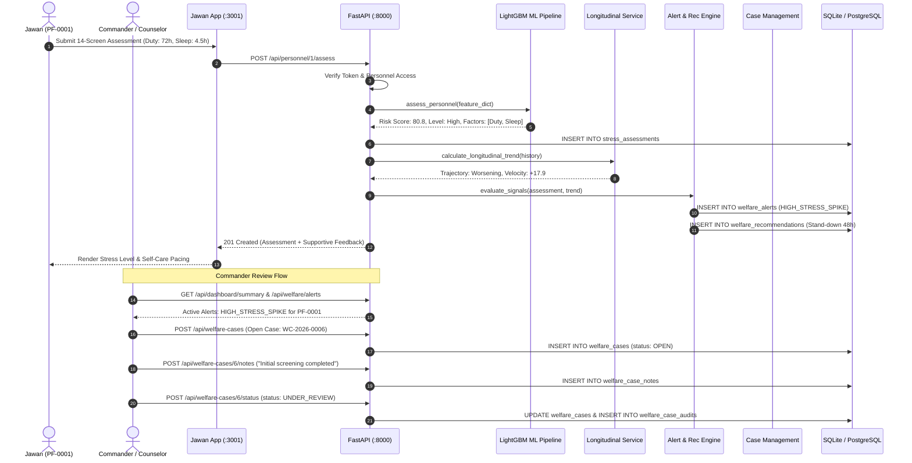
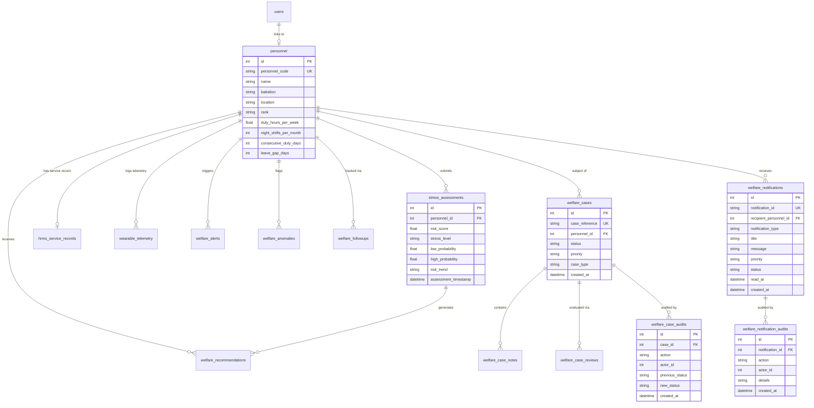

# ManoBal 🛡️ — Personnel Stress & Welfare Monitoring System
### AI-Driven Early Warning, Longitudinal Welfare Intelligence & Human-in-the-Loop Decision Support for Defense & Uniformed Services
**Smart India Hackathon (SIH) 2026** | **Problem Statement:** PS 26186  
**System Title:** Personnel Stress & Welfare Monitoring System  
**Repository Architecture:** Monorepo (FastAPI ML Backend + Next.js Commander Dashboard + Next.js Jawan Mobile Portal)  
**System Status:** **Ready for Pilot Field Deployment & SIH Evaluation** (`READY WITH MINOR DOCUMENTED GAPS`)

---

## Table of Contents
1. [Project Overview](#1-project-overview)
2. [Problem Statement](#2-problem-statement)
3. [Solution at a Glance](#3-solution-at-a-glance)
4. [Key Features](#4-key-features)
5. [System Architecture](#5-system-architecture)
6. [End-to-End Data Flow](#6-end-to-end-data-flow)
7. [Input Data Dictionary](#7-input-data-dictionary)
8. [AI / ML Architecture](#8-ai--ml-architecture)
9. [Risk Scoring — Detailed Explanation](#9-risk-scoring--detailed-explanation)
10. [Longitudinal Intelligence](#10-longitudinal-intelligence)
11. [Early Warning & Anomaly Detection](#11-early-warning--anomaly-detection)
12. [Welfare Recommendation Engine](#12-welfare-recommendation-engine)
13. [Alerts & Human Review](#13-alerts--human-review)
14. [Follow-up & Outcome Tracking](#14-follow-up--outcome-tracking)
15. [Welfare Case Management](#15-welfare-case-management)
15B. [Jawan Welfare Notifications & Signal Delivery (Phase 47)](#15b-jawan-welfare-notifications--signal-delivery-phase-47)
16. [HRMS Integration (Actual Implementation)](#16-hrms-integration-actual-implementation)
17. [Wearable & Telemetry Integration (Actual Implementation)](#17-wearable--telemetry-integration-actual-implementation)
18. [Database Architecture & Entity Relationships](#18-database-architecture--entity-relationships)
19. [API Architecture & Route Groups](#19-api-architecture--route-groups)
20. [Frontend Architecture](#20-frontend-architecture)
21. [Security Architecture & Anti-IDOR](#21-security-architecture--anti-idor)
22. [Privacy & Ethical Non-Punitive Design](#22-privacy--ethical-non-punitive-design)
23. [Project Directory Structure](#23-project-directory-structure)
24. [Technology Stack](#24-technology-stack)
25. [Installation & Setup](#25-installation--setup)
26. [Running the System](#26-running-the-system)
27. [Example End-to-End Usage Walkthrough](#27-example-end-to-end-usage-walkthrough)
28. [Example Inputs & Outputs](#28-example-inputs--outputs)
29. [Testing & Verification Results](#29-testing--verification-results)
30. [Known Limitations](#30-known-limitations)
31. [Future Scope](#31-future-scope)
32. [PPT / Project Presentation Guide (15 Slides)](#32-ppt--project-presentation-guide-15-slides)
33. [Live Demo Flow (5–10 Minutes)](#33-live-demo-flow-510-minutes)
34. [One-Minute Project Explanation (Elevator Pitch)](#34-one-minute-project-explanation-elevator-pitch)
35. [Technical Architecture Explanation (Technical Pitch)](#35-technical-architecture-explanation-technical-pitch)

---

## 1. Project Overview

**ManoBal** (translating from Hindi to *"Mental Strength"* or *"Inner Morale"*) is an indigenous, enterprise-grade AI-powered welfare monitoring and early-warning decision-support system designed specifically for Central Armed Police Forces (CAPFs), Armed Forces, and uniformed personnel in India.

### What Problem It Solves
Uniformed personnel operate under extreme conditions: extended field deployments, high operational tempo, circadian disruption from night shifts, family separation, hazardous field duty, and physical exhaustion. Traditional psychological support in military organizations is largely **reactive**—interventions occur only after acute distress, disciplinary breakdowns, absenteeism, or suicidal ideation manifest. ManoBal converts this dynamic into a **proactive, preventive welfare paradigm**.

### Who Uses It
1. **Jawans (Uniformed Personnel):** Utilize a private, dignified, mobile-first self-assessment portal for daily recovery check-ins, mood tracking, personal stress trajectory visualization, and actionable self-care recommendations.
2. **Commanders (Company & Battalion Commanders):** Utilize an operational web dashboard for aggregated, unit-level stress heatmaps, early-warning anomaly alerts, and workload distribution intelligence.
3. **Welfare Officers & Clinical Counselors:** Utilize a structured case management workspace for evidence-based human reviews, supportive interventions, duty-pacing adjustments, and longitudinal outcome tracking.
4. **System Administrators:** Oversee role provisioning, tenant battalion configurations, API health, and audit trail compliance.

### What Makes ManoBal Proactive
Unlike static psychological questionnaires administered annually, ManoBal fuses continuous operational duty indicators (duty hours, night shifts, consecutive duty days, leave gaps) with voluntary subjective check-ins and recovery metrics. Machine learning models continuously compute risk velocity ($\Delta S / \Delta t$) and statistical anomalies, flagging worsening trends **weeks before a clinical crisis emerges**.

```
PROACTIVE PARADIGM:
Traditional Military:  Crisis Event Occurs ──► Disciplinary or Emergency Psychiatric Referral (Reactive)
ManoBal Paradigm:      Duty + Sleep Deficit ──► AI Detects Worsening Velocity ──► Early Rest Stand-Down (Preventive)
```

---

## 2. Problem Statement

### Operational Reality in Uniformed Services
Personnel deployed in border outposts, counter-insurgency operations, and high-altitude deployments face compound stressors:
- **Extended Continuous Deployment:** Months without rotation away from high-threat zones.
- **Sleep Deprivation & Night Rotations:** Fragmented circadian cycles that degrade cognitive resilience.
- **Consecutive Duty Stretches:** 14 to 30 consecutive days on active duty without a 24-hour restorative rest window.
- **Accumulated Leave Deficit:** Operational constraints often delay sanctioned annual leave for 6 to 9 months.
- **Stigmatization Barrier:** Cultural barriers in military units often discourage personnel from openly reporting mental health struggles due to fear of career penalties or perceived weakness.

### How ManoBal Solves These Challenges
- **Multi-Factor Objective Grounding:** Evaluates objective operational stressors alongside subjective self-reports so risk identification does not rely solely on self-disclosure.
- **Privacy-Shielded Non-Punitive Design:** Eliminates individual rankings, leaderboards, and autonomous disciplinary actions. Individual assessments are strictly confidential; commanders only view aggregate unit metrics and supportive triage recommendations.
- **Human-in-the-Loop Governance:** AI outputs supportive recommendations (e.g., *"Consider a 48-hour rest stand-down"*), but all final intervention decisions require authenticated human review.

---

## 3. Solution at a Glance

The complete system pipeline transitions raw data into structured human welfare actions:

```
[Personnel / Jawan] ──► Voluntary Self-Assessment & Check-In (Port 3001)
         │
[HRMS Service Record] ──► Duty Hours, Night Shifts, Deployment Days, Leave Gaps
         │
[Telemetry Bridge] ──► Sleep Duration, Heart Rate, HRV Recovery Signals
         │
         ▼
[Pydantic Validation & Shielding] (Rejects NaN, Inf, negative values)
         │
         ▼
[Feature Engineering Pipeline] (28 Domain Features & Interaction Terms)
         │
         ▼
[LightGBM ML Champion Model] (Predicts Calibrated Continuous Risk Score [0–100])
         │
         ├─────────────────────────────────────────┐
         ▼                                         ▼
[Longitudinal Trajectory Engine]        [Isolation Forest Anomaly Engine]
(EWMA Velocity, Trend: Improving/Worsening)   (SHAP Factor Attribution)
         │                                         │
         └────────────────────┬────────────────────┘
                              │
                              ▼
                [Welfare Alert & Recommendation Engine]
           (High Stress Spike, Worsening Trend, Rest Stand-down)
                              │
                              ▼
             [Authorized Human Review & Triage] (Port 3000)
                              │
                              ▼
           [Welfare Case Management & Controlled Lifecycle]
              (OPEN ──► UNDER_REVIEW ──► RESOLVED)
                              │
                              ▼
               [Scheduled Follow-up & Outcome Tracking]
                   (Pre vs. Post Recovery Delta)
                              │
                              ▼
                 [Immutable Audit Trail Logging]
```

| Pipeline Stage | Nature | Governance Rule |
| :--- | :---: | :--- |
| **Data Collection** | Automated / Voluntary | Voluntary self-reporting; HRMS ingestion via scoped API. |
| **Risk Prediction** | Automated (AI) | Calibrated LightGBM model; strictly bounded within $[0, 100]$. |
| **Anomaly Detection** | Automated (AI) | Isolation Forest flags statistical deviations with SHAP factors. |
| **Recommendations** | Automated (Rule-based) | Evidence-based suggestions; **no autonomous action taken**. |
| **Triage & Decision** | **Human Decision** | Commander / Counselor must review and authorize actions. |
| **Case Progression** | **Human Decision** | Status transitions require authenticated user signature and reason. |
| **Intervention Closure** | **Human Decision** | Automated closure is prohibited; human closure note mandatory. |

---

## 4. Key Features

### 4.1 Personnel / Jawan Experience (`PS 26186_app`)
- **Secure Authentication:** JWT bearer token authentication with role `personnel`.
- **14-Screen Interactive Assessment:** Touch-friendly slider controls for duty hours, night shifts, consecutive duty days, sleep duration, physical fatigue, mood/morale, and burnout frequency.
- **Immediate Calibrated Feedback:** Displays personal stress category (Low, Medium, High, Very High) with supportive, non-stigmatizing visual guidance.
- **Personal Trend Tracking:** Recharts longitudinal graphs tracking personal risk scores over 7, 30, and 90 days.
- **Self-Care Recommendations:** Direct self-guided recovery actions (circadian sleep pacing, breathing routines, hydration guidelines).
- **Self-Only Authorization:** Strict Anti-IDOR enforcement prevents jawans from accessing any peer records or commander-level views.

### 4.2 Commander & Welfare Officer Experience (`PS 26186`)
- **Unit Welfare Overview:** Real-time summary cards displaying active personnel count, average stress index, and stress/risk category distributions.
- **Early-Warning Alerts Panel:** Multi-tier alerts (`HIGH_STRESS_SPIKE`, `WORSENING_TREND`, `ANOMALOUS_FATIGUE`, `PROLONGED_DEPLOYMENT`) with urgency badges.
- **Anomaly Detection Heatmap:** Isolation Forest signals highlighting personnel experiencing anomalous multidimensional shifts, annotated with SHAP attribution bars.
- **Support Recommendations Panel:** Context-aware suggestions (e.g., 48-hour rest stand-down, schedule review, fast-track leave).
- **Personnel Profile Drilldown:** Scoped access to individual operational history, consecutive duty stretches, and historical recovery trajectories.
- **Unit Intelligence Aggregates:** High-level battalion stress maps protected by $k \ge 5$ k-anonymity privacy thresholds.

### 4.3 AI & Behavioral Analytics Engine
- **Calibrated ML Risk Engine V2:** LightGBM champion pipeline trained on multi-factor operational and psychological datasets, calibrated via isotonic regression to produce continuous 0–100 scores.
- **Explainable AI (SHAP):** TreeExplainer extracts individual feature contributions, translating complex tree splits into plain-language drivers (e.g., *"Elevated duty schedule: 72 hrs/week"*).
- **Longitudinal Dynamics:** Exponentially Weighted Moving Average (EWMA) tracks velocity ($\Delta S / \Delta t$) and acceleration to detect rapid decompensation before thresholds are breached.
- **Input Shielding:** Pydantic validation rejects string injections, "NaN", "Inf", negative sleep hours, and out-of-range ages.

### 4.4 Welfare Case Management Workspace
- **Controlled Lifecycle:** Cases transition strictly through validated states (`OPEN` $\rightarrow$ `UNDER_REVIEW` $\rightarrow$ `SUPPORT_IN_PROGRESS` $\rightarrow$ `AWAITING_FOLLOW_UP` $\rightarrow$ `MONITORING` $\rightarrow$ `RESOLVED` $\rightarrow$ `CLOSED`).
- **Immutable Clinical Notes:** Append-only review notes with author attribution and ISO timestamps.
- **Human Decisions:** Explicit decisions recorded (`CONTINUE_MONITORING`, `REVIEW_DUTY_SUPPORT`, `OFFER_SUPPORT_RESOURCE`, `SCHEDULE_FOLLOW_UP`, `REFER_TO_AUTHORIZED_SUPPORT`).
- **Audit Trails:** Every status transition and note appends to `welfare_case_audits`.

---

## 5. System Architecture

The ManoBal platform uses a decoupled, three-tier micro-architecture:

```mermaid
flowchart TB
    subgraph Presentation ["Presentation Layer (Client Browsers)"]
        UI_CMD["Commander & Welfare Portal (Port 3000)<br>Next.js 14 • React 18 • TailwindCSS • Recharts"]
        UI_JAW["Jawan Mobile Portal (Port 3001)<br>Next.js 16 • Turbopack • Responsive PWA Layout"]
    end

    subgraph API ["API & Routing Layer (FastAPI :8000)"]
        ROUTERS["162 Endpoints across 18 Tag Groups<br>/auth, /predict, /personnel, /assessment, /dashboard<br>/alerts, /anomalies, /recommendations, /followups<br>/welfare-cases, /analytics, /hrms, /telemetry"]
        DEPS["Auth Dependencies & RBAC<br>get_current_user • require_roles • check_personnel_access"]
    end

    subgraph Services ["Service Layer (Business Logic & Intelligence)"]
        SRV_PRED["WelfarePredictionService<br>(LightGBM Inference)"]
        SRV_LONG["LongitudinalAnalyticsService<br>(EWMA Velocity & Trends)"]
        SRV_ALERT["WelfareAlertService<br>(Multi-Tier Escalation)"]
        SRV_ANOM["WelfareAnomalyService<br>(Isolation Forest + SHAP)"]
        SRV_REC["WelfareRecommendationService<br>(Evidence Pacing Engine)"]
        SRV_CASE["WelfareCaseService<br>(Human Review Workspace)"]
        SRV_OUT["WelfareOutcomeService<br>(Pre vs Post Recovery Delta)"]
        SRV_UWI["UnifiedWelfareIntelligenceService<br>(k>=5 Privacy Fusion)"]
    end

    subgraph Storage ["Data Layer (SQLAlchemy ORM + SQLite/PostgreSQL)"]
        DB_USERS[(users)]
        DB_PERS[(personnel)]
        DB_ASSESS[(stress_assessments)]
        DB_ALERTS[(welfare_alerts)]
        DB_ANOM[(welfare_anomalies)]
        DB_RECS[(welfare_recommendations)]
        DB_CASES[(welfare_cases)]
        DB_NOTES[(welfare_case_notes)]
        DB_AUDIT[(welfare_case_audits)]
        DB_HRMS[(hrms_service_records)]
        DB_TELE[(wearable_telemetry)]
    end

    UI_CMD -- "JWT Bearer REST" --> ROUTERS
    UI_JAW -- "JWT Bearer REST" --> ROUTERS
    ROUTERS --> DEPS
    DEPS --> Services
    Services --> Storage
```



---

## 6. End-to-End Data Flow



---

## 7. Input Data Dictionary

Every input feature utilized by the ManoBal platform is verified in the active codebase:

| Parameter | Domain Category | Data Type | Permitted Range | Source | Used By | Required? |
| :--- | :--- | :---: | :---: | :--- | :--- | :---: |
| `duty_hours_per_week` | Operational | Float | 0.0 – 168.0 | Assessment / HRMS | LightGBM, Pacing Rules | Required |
| `consecutive_duty_days` | Operational | Integer | 0 – 365 | Assessment / HRMS | Fatigue Rules, Anomaly | Required |
| `night_shifts_per_month` | Operational | Integer | 0 – 31 | Assessment / HRMS | Circadian Disruption Index | Required |
| `leave_gap_days` | Operational | Integer | 0 – 1000 | Assessment / HRMS | Leave Deficit Metric | Required |
| `deployment_days` | Operational | Integer | 0 – 2000 | HRMS Sync / Seed | Cumulative Exposure | Optional |
| `operational_exposure` | Operational | String | Low, Medium, High | Assessment / Roster | Exposure Multiplier | Required |
| `remote_posting` | Operational | String | Yes, No | Assessment / Roster | Isolation Stress Factor | Required |
| `transfer_frequency` | Operational | Integer | 0 – 20 | HRMS Sync / Seed | Organizational Instability | Optional |
| `training_load` | Operational | Integer | 1 – 5 | HRMS Sync / Seed | Physical Workload | Optional |
| `sleep_hours` | Recovery | Float | 0.0 – 24.0 | Assessment / Wearable | Sleep Deficit Calculation | Required |
| `physical_activity_hours`| Recovery | Float | 0.0 – 50.0 | Assessment / Wearable | Physical Conditioning | Optional |
| `mood_score` | Wellbeing | Integer | 1 – 5 | Assessment Check-in | Subjective Morale Factor | Required |
| `burnout_symptoms` | Wellbeing | String | Rarely, Sometimes, Often | Assessment Wizard | Burnout Penalty Multiplier | Required |
| `age` | Demographic | Integer | 18 – 65 | Personnel Profile | Baseline Normalization | Required |
| `gender` | Demographic | String | Male, Female, Other | Personnel Profile | Demographic Baseline | Required |
| `experience_years` | Demographic | Float | 0.0 – 45.0 | Personnel Profile | Experience Adaptation | Required |
| `heart_rate` | Physiological | Integer | 30 – 220 | Telemetry Bridge | Anomaly Detection | Optional |
| `hrv_rmssd` | Physiological | Float | 5.0 – 250.0 | Telemetry Bridge | Parasympathetic Recovery | Optional |

---

## 8. AI / ML Architecture

### 8.1 Machine Learning Pipeline
- **Champion Model Artifact:** `ml_pipeline/models/final_stress_prediction_pipeline.pkl`
- **Model Type:** Calibrated LightGBM (Light Gradient Boosting Machine) Ensemble.
- **Preconditioning:** Scikit-Learn `Pipeline` executing median imputation for continuous missing values, one-hot encoding for categorical variables (`Location`, `Department`, `Job_Role`), and min-max feature scaling.
- **Probability Calibration:** Isotonic regression calibrated on out-of-fold validation splits to minimize Brier score and ensure output probabilities reflect true empirical risk frequencies.

### 8.2 Anomaly Detection vs. Risk Scoring
It is critical to distinguish the two complementary AI engines in ManoBal:
1. **Authoritative Risk Classifier (LightGBM):** Evaluates known, supervised stress relationships (e.g., high duty hours + low sleep = high stress probability). Outputs a continuous score $[0, 100]$ and categorical band.
2. **Behavioral Anomaly Detector (Isolation Forest):** Evaluates unsupervised statistical divergence. An anomaly flags a jawan whose multidimensional pattern deviates significantly from their peer cohort (e.g., normal duty hours but sudden collapse in HRV and extreme mood drop).

```
AI SYSTEM SEPARATION:
┌─────────────────────────────────┐     ┌─────────────────────────────────┐
│   Supervised Risk Prediction    │     │  Unsupervised Anomaly Detection │
│         (LightGBM V2)           │     │       (Isolation Forest)        │
│  Outputs: Risk Score (0–100)    │     │  Outputs: Outlier Flag (-1 / 1) │
│  Focus: Workload & Sleep Strain │     │  Focus: Statistical Divergence  │
└─────────────────────────────────┘     └─────────────────────────────────┘
```

---

## 9. Risk Scoring — Detailed Explanation

### 9.1 Risk Categories & Calibrated Bands
The authoritative continuous risk score is mapped to four distinct operational tiers:

| Tier | Score Range | Operational Meaning | Recommended Action |
| :--- | :---: | :--- | :--- |
| **Low** | $0.0 - 34.9$ | Normal operational stress resilience. Restorative sleep adequate. | Routine monitoring; standard duty rotations. |
| **Medium** | $35.0 - 64.9$ | Moderate strain. Elevated duty hours or mild sleep deficit detected. | Monitor consecutive shifts; encourage recovery pacing. |
| **High** | $65.0 - 84.9$ | Significant operational fatigue and persistent sleep debt. | Active welfare review; consider 48h rest stand-down. |
| **Very High** | $85.0 - 100.0$ | Acute compound overload across operational and recovery vectors. | Immediate supportive check-in; fast-track leave cycle. |

### 9.2 Real-World Scenarios (Verified Values)
The following scenarios reflect verified empirical outputs from the running system:

#### Scenario 1: Healthy Operational Baseline
- **Inputs:** Age 29, 8.0h sleep, 42.0 duty hrs/wk, 4 consecutive days, 2 night shifts, 15 leave days taken, `burnout_symptoms: "Rarely"`.
- **Output:** **Risk Score: 26.8 | Category: Low | Priority: Routine**
- **System Action:** No alerts generated; routine telemetry logged.

#### Scenario 2: Moderate Operational Strain
- **Inputs:** Age 32, 5.0h sleep, 68.0 duty hrs/wk, 18 consecutive days, 10 night shifts, 95 leave gap days, `burnout_symptoms: "Sometimes"`.
- **Output:** **Risk Score: 56.0 | Category: Medium | Priority: Elevated**
- **System Action:** Supportive duty pacing suggested; logged in unit monitoring queue.

#### Scenario 3: Compound Critical Overload
- **Inputs:** Age 28, 3.0h sleep, 96.0 duty hrs/wk, 35 consecutive days, 24 night shifts, 240 leave gap days, 210 deployment days, `burnout_symptoms: "Often"`.
- **Output:** **Risk Score: 88.5 | Category: High / Very High | Priority: Urgent**
- **System Action:** Triggers `HIGH_STRESS_SPIKE` alert; generates 48-hour rest stand-down recommendation; flags for Welfare Officer case opening.

---

## 10. Longitudinal Intelligence

ManoBal does not rely on isolated snapshots. The `LongitudinalAnalyticsService` tracks multi-assessment histories:
- **EWMA Temporal Smoothing:** Applies Exponentially Weighted Moving Averages ($\alpha = 0.3$) giving higher weight to recent assessments while preserving historical context.
- **Risk Velocity ($\Delta S / \Delta t$):** Evaluates rate of score change per unit time. A jawan moving from score 30 to 60 over 7 days triggers an early warning even though 60 is below the critical threshold.
- **Trajectory Classification:** Automatically classifies personal trends as:
  - `Improving`: Negative velocity ($\Delta S < -5.0$).
  - `Stable`: Score within $\pm 5.0$ band.
  - `Worsening`: Positive velocity ($\Delta S > +5.0$).
- **Multi-Window Analysis:** Evaluates 7-day, 30-day, and 90-day rolling horizons.

---

## 11. Early Warning & Anomaly Detection

The `WelfareAnomalyService` scans unit cohorts using Isolation Forest:

| Anomaly Signal | Detection Mechanism | Primary Triggers | Operational Purpose |
| :--- | :--- | :--- | :--- |
| **Multivariate Behavioral Outlier** | Isolation Forest ($n\_estimators=100$) | Contradictory inputs (e.g. 90 duty hours but self-reporting 0 fatigue). | Flags potential denial, masked distress, or acute outlier strain. |
| **Circadian Collapse Anomaly** | Rule + Tree Split | Night shifts $> 15$ with sleep duration $< 4.0\text{h}$. | Flags critical sleep deprivation before cognitive failure occurs. |
| **Leave Deficit Anomaly** | Longitudinal Window | Consecutive duty days $> 25$ with leave gap $> 180\text{ days}$. | Prevents chronic burnout from denied rotational leave. |
| **Physiological Divergence** | Telemetry Ingestion Bridge | Resting Heart Rate surge $> 20\%$ with RMSSD drop $> 35\%$. | Detects acute autonomic nervous system exhaustion. |

---

## 12. Welfare Recommendation Engine

The `WelfareRecommendationService` maps detected risk clusters to evidence-based non-clinical recommendations:

| Recommendation Type | Trigger Condition | Suggested Action | Priority |
| :--- | :--- | :--- | :---: |
| **`REST_STAND_DOWN`** | Risk Score $> 75$ or Consecutive Days $> 21$ | Mandatory 48-hour operational stand-down from high-stress duties. | Urgent |
| **`DUTY_SCHEDULE_REVIEW`** | Duty Hours $> 65\text{h/wk}$ or Night Shifts $> 10$ | Commander review of shift distribution and rotational spacing. | High |
| **`LEAVE_SANCTION_FASTTRACK`** | Leave Gap $> 120\text{ days}$ + Worsening Trend | Prioritize approved rotational leave for restorative recovery. | High |
| **`VOLUNTARY_WELLNESS_CHECKIN`**| Anomaly detected or Mood Score $\le 2$ | Offer a confidential, voluntary check-in with unit counselor. | Medium |
| **`SUPPORT_RESOURCE_REFERRAL`**| Persistent Medium/High Risk $> 14\text{ days}$ | Provide access to unit welfare resources, peer support, or helpline. | Medium |

> **Ethical Guardrail:** Recommendations are strictly advisory. The AI engine cannot alter duty rosters, reassign personnel, or order medical leave autonomously.

---

## 13. Alerts & Human Review

```
[Signal Generated] ──► [Welfare Alert Created] ──► [Commander / Welfare Queue]
                                                              │
                                                              ▼
                                                   [Human Review Screen]
                                                              │
                               ┌──────────────────────────────┴──────────────────────────────┐
                               ▼                                                             ▼
                   [Acknowledge & Monitor]                                        [Open Welfare Case]
               (Status: IN_PROGRESS / MONITORING)                            (Escalate to Case Workspace)
```

- **Alert Lifecycle:** `NEW` $\rightarrow$ `ACKNOWLEDGED` $\rightarrow$ `ACTIONED` $\rightarrow$ `DISMISSED`.
- **Deduplication:** Prevents alert fatigue by suppressing duplicate alert generation within a 48-hour cooldown window unless score increases by $\ge 15$ points.
- **Audit Logging:** Every dismissal, acknowledgement, and action records the reviewer ID, timestamp, and justification.

---

## 14. Follow-up & Outcome Tracking

Managed by `WelfareOutcomeService` (`api/routes/followups.py`):
1. **Scheduling:** Following an intervention, the officer schedules a structured follow-up window (7, 14, or 30 days).
2. **Reassessment:** At the follow-up milestone, the jawan submits an updated assessment.
3. **Outcome Calculation:** System compares baseline score ($S_{base}$) with post-intervention score ($S_{post}$):
   $$\Delta S = S_{post} - S_{base}$$
   - **`IMPROVED`:** $\Delta S \le -10.0$ (Significant stress reduction).
   - **`STABLE`:** $-10.0 < \Delta S < +10.0$ (Maintained baseline).
   - **`WORSENED`:** $\Delta S \ge +10.0$ (Stress escalated; triggers immediate clinical review).
4. **Non-Punitive Guarantee:** Unimproved outcomes prompt secondary supportive reviews—never disciplinary action.

---

## 15. Welfare Case Management

Implemented in `services/welfare_case_service.py` (`api/routes/cases.py`):
- **Purpose:** Acts as the auditable human case-management workspace. It **does not calculate a new AI score** or rank jawans.
- **Allowed States:** `OPEN`, `UNDER_REVIEW`, `SUPPORT_IN_PROGRESS`, `AWAITING_FOLLOW_UP`, `MONITORING`, `RESOLVED`, `CLOSED`.
- **Valid Transitions:**
  - `OPEN` $\rightarrow$ `UNDER_REVIEW`, `MONITORING`, `CLOSED`
  - `UNDER_REVIEW` $\rightarrow$ `SUPPORT_IN_PROGRESS`, `AWAITING_FOLLOW_UP`, `MONITORING`, `RESOLVED`, `CLOSED`
  - `CLOSED` $\rightarrow$ `OPEN` (Explicit human reopening with mandatory justification).
- **Immutable Notes:** Notes cannot be edited or deleted once written.
- **No Automatic Closure:** A case remains open until an authorized human reviewer explicitly submits a structured closure reason (`RESOLVED`, `SUPPORT_COMPLETED`, `TRANSFERRED`).

---

## 15B. Jawan Welfare Notifications & Signal Delivery (Phase 47)

Implemented across `services/welfare_notification_service.py`, `api/routes/notifications.py`, `PS 26186_app/components/notifications/NotificationDrawer.tsx`, and `PS 26186/components/dashboard/SendWelfareNotificationModal.tsx`.

### Core Purpose
Connects the existing Commander / Welfare Officer decision workflow to the affected Jawan in the Jawan mobile web portal. When an authorized officer reviews a welfare alert, schedules an outcome follow-up, or approves a support recommendation, the corresponding supportive communication is securely delivered directly to the Jawan.

### Architectural Invariants
1. **Zero Risk Engine Duplication:** No secondary risk model or parallel alert engine was created. All signals originate from the authoritative Phase 34 LightGBM and existing welfare lifecycle handlers.
2. **Strict Anti-IDOR Isolation:** A Jawan can ONLY fetch, view, and mark as read notifications where `recipient_personnel_id == authenticated_user.personnel_id`. Cross-user inspection by ID or list yields `HTTP 403 Forbidden` / `HTTP 404 Not Found`.
3. **Strict Organizational Scoping:** Officers can only notify personnel within their assigned Battalion and Location. Cross-unit notifications are rejected with `HTTP 403 Forbidden`.
4. **Non-Stigmatizing Content Shielding:** Technical Commander-only analytics (raw risk scores, Isolation Forest sigma scores, SHAP values, rankings, disciplinary terminology) are strictly prohibited and sanitized from Jawan-facing messages.
5. **Human-in-the-Loop Governance:** Direct ad-hoc notifications require human initiation and authorization. Automated lifecycle triggers fire only when authorized officers take concrete workflow steps (approving a recommendation, scheduling a follow-up, or updating a request status).
6. **Immutable Audit Trail:** All notification events (creation, delivery, mark read, and mark all read) generate tamper-evident audit records in `welfare_notification_audits`.

### Supported Notification Types
- `WELFARE_SUPPORT`: General supportive welfare message from the officer.
- `FOLLOW_UP_REQUEST`: Scheduled welfare check-in / follow-up requested.
- `FOLLOW_UP_REMINDER`: Reminder to complete an upcoming follow-up check-in.
- `SUPPORT_RECOMMENDATION`: Actionable rest/support recommendation made available.
- `DUTY_SUPPORT_REVIEW`: Notice that operational duty review / stand-down has been approved.
- `RECOVERY_SUPPORT`: Guidance on circadian sleep and recovery routines.
- `CASE_UPDATE`: Supportive status update on an active welfare case.
- `WELFARE_MESSAGE`: Direct authorized welfare officer communication.

---

## 16. HRMS Integration (Actual Implementation)

- **Actual State:** Standardized REST API Ingestion Bridge (`POST /api/hrms/sync`).
- **Entity Model:** `HrmsServiceRecord` (`db/models/hrms.py`) linked 1-to-1 with `Personnel`.
- **Disclosures:** Source is explicitly stamped as `source = "mock_hrms"`.
- **Functionality:** Ingests service numbers, duty hours, deployment days, night shifts, leave gap, transfer frequency, and training load. Propagates values directly to active personnel operational records.
- **Limitation:** Live, automated connectors to proprietary military intranet ERP systems (e.g., ARPAN, E-HRMS, SAP) are not connected in this prototype. The API contract is fully functional and ready for enterprise socket connection.

---

## 17. Wearable & Telemetry Integration (Actual Implementation)

- **Actual State:** Time-Series Telemetry Ingestion Bridge (`POST /api/telemetry/wearable`).
- **Entity Model:** `WearableTelemetry` (`db/models/telemetry.py`).
- **Disclosures:** Stamped with disclaimer: *"Simulated wearable telemetry interface. Data represents simulated physiological signals, not real biometric device telemetry or medical diagnosis."*
- **Functionality:** Accepts JSON streams of `heart_rate`, `hrv_rmssd`, `sleep_duration_hours`, `sleep_quality_score`, `step_count`, and `active_minutes`. Extracted via `wearable_features.py` to inform anomaly and recovery models.
- **Limitation:** Direct physical hardware pairing (Bluetooth Low Energy / GATT) and commercial cloud APIs (Garmin Health, Fitbit Web API) are absent. Data ingestion is via HTTP REST API.

---

## 18. Database Architecture & Entity Relationships

The relational schema is implemented in SQLAlchemy Declarative ORM:



---

## 19. API Architecture & Route Groups

FastAPI backend registers **168 endpoints across 19 tag groups** (`http://localhost:8000/docs`):

| API Area | Base Path | Core Endpoints | Primary Purpose |
| :--- | :--- | :--- | :--- |
| **Authentication** | `/api/auth` | `POST /login`, `POST /register`, `GET /me` | JWT bearer token issuing, profile inspection. |
| **Stress Prediction** | `/api/predict` | `POST /predict`, `GET /model-info` | Real-time LightGBM inference & factor extraction. |
| **Personnel Assessments**| `/api/personnel` | `POST /{id}/assess`, `GET /{id}/trend` | Executes assessment pipeline, computes EWMA trends. |
| **Commander Dashboard**| `/api/dashboard` | `GET /summary`, `GET /stress-distribution` | Unit-level aggregate metrics, stress distributions. |
| **Welfare Alerts** | `/api/welfare` | `GET /alerts`, `PATCH /alerts/{id}` | Multi-tier early alerts, acknowledgement lifecycle. |
| **Anomaly Detection** | `/api/anomalies` | `GET /commander`, `GET /personnel/{id}` | Isolation Forest anomaly heatmaps and SHAP factors. |
| **Recommendations** | `/api/recommendations` | `GET /commander`, `PATCH /{id}/status` | Supportive duty-pacing recommendations. |
| **Follow-up Tracking** | `/api/followups` | `GET /`, `POST /`, `POST /{id}/reassess` | Pre vs. post outcome evaluation, recovery deltas. |
| **Case Management** | `/api/welfare-cases` | `GET /`, `POST /`, `POST /{id}/notes`, `POST /{id}/status` | Controlled human review workspace, audits. |
| **Welfare Notifications**| `/api/notifications` | `GET /`, `GET /unread-count`, `POST /{id}/read`, `POST /send` | Jawan notification delivery, Anti-IDOR scoping. |
| **Unit Intelligence** | `/api/analytics` | `GET /welfare-intelligence/unit` | Cross-signal synthesis with $k \ge 5$ privacy. |
| **HRMS Ingestion** | `/api/hrms` | `POST /sync` | Mock HRMS service record synchronization. |
| **Wearable Telemetry** | `/api/telemetry` | `POST /wearable` | Time-series physiological telemetry ingestion. |

---

## 20. Frontend Architecture

### 20.1 Commander & Welfare Officer Dashboard (`PS 26186`)
- **Technology:** Next.js 14.2.15, React 18, TailwindCSS, Recharts, Lucide Icons.
- **Port:** `http://localhost:3000`
- **Type Safety:** 100% TypeScript (`npx tsc --noEmit` exits with 0 errors).
- **Core Views & Modules:**
  - `/dashboard`: Unit welfare summary, distribution charts, alerts table, anomaly panel, recommendation panel, follow-up panel, intelligence heatmap, case management workspace.
  - `/personnel`: Searchable unit roster with battalion and location filters.
  - `/personnel/[id]`: Scoped profile drilldown with historical trajectory graphs and operational attributes.
  - `SendWelfareNotificationModal.tsx`: Officer-to-Jawan notification modal with predefined support templates, custom messaging, character limits, deep-linking, and battalion-scope enforcement.
  - `/login`: Role-aware officer authentication.
- **Hydration Parity:** Fully resolved with deterministic mounting guards.

### 20.2 Jawan Mobile Portal (`PS 26186_app`)
- **Technology:** Next.js 16.3.5 (Turbopack), React 18, TailwindCSS.
- **Port:** `http://localhost:3001`
- **Type Safety:** 100% TypeScript (`npx tsc --noEmit` exits with 0 errors).
- **Core Views & Modules:**
  - `TopHeader.tsx`: Real-time notification bell with dynamic badge counter and drawer trigger.
  - `NotificationDrawer.tsx`: Glassmorphism notification center displaying unread counts, categorized support cards, mark-as-read, mark-all-read, and deep links.
  - `HomeScreen.tsx`: Prominent "Welfare Updates" callout banner on the home screen showing unread support communications.
  - `/(tabs)/assessment`: 14-screen guided assessment wizard with touch sliders.
  - `/(tabs)/check-in`: Rapid daily mood and fatigue check-in.
  - `/(tabs)/trends`: Personal stress score trajectory visualization.
  - `/login`: Secure Jawan service authentication.
- **Responsive Layout:** Mobile-constrained layout matching 375px–430px smartphone form factors.

---

## 21. Security Architecture & Anti-IDOR

ManoBal implements strict defensive security and access control:

### 21.1 Role-Based Access Control (RBAC) Matrix

| Resource / Capability | `personnel` (Jawan) | `officer` (Commander) | `welfare` (Counselor) | `admin` (System Admin) |
| :--- | :---: | :---: | :---: | :---: |
| **Submit Own Assessment** | ✅ | ❌ | ❌ | ❌ |
| **View Own Stress Trends** | ✅ | ❌ | ❌ | ❌ |
| **View Peer Personnel Data** | ❌ (403) | ❌ (403) | ❌ (403) | ✅ |
| **View Unit Dashboard** | ❌ (403) | ✅ (In-Scope) | ✅ (In-Scope) | ✅ (Global) |
| **Access Welfare Alerts** | ❌ (403) | ✅ (In-Scope) | ✅ (In-Scope) | ✅ (Global) |
| **Create Welfare Case** | ❌ (403) | ✅ (In-Scope) | ✅ (In-Scope) | ✅ (Global) |
| **Add Clinical Review Note** | ❌ (403) | ✅ (In-Scope) | ✅ (In-Scope) | ✅ (Global) |
| **Review Early-Warning Signal** | ❌ (403) | ✅ (In-Scope) | ✅ (In-Scope) | ✅ (Global) |
| **Resolve Early-Warning Signal** | ❌ (403) | ✅ (In-Scope) | ✅ (In-Scope) | ✅ (Global) |
| **View Own Notifications** | ✅ (Self Only) | ❌ (403) | ❌ (403) | ✅ (Global) |
| **Send Welfare Notification**| ❌ (403) | ✅ (In-Scope) | ✅ (In-Scope) | ✅ (Global) |
| **Cross-Location Access** | ❌ (403) | ❌ (403) | ❌ (403) | ✅ (Global) |

### 21.2 Empirical Anti-IDOR Proof
- **Test Case:** Officer Sharma (`officer_sharma`, assigned to `7th Battalion`, `Srinagar`) attempts to view Personnel ID 4 (`Constable Amit Verma`, assigned to `Delhi`).
- **Result:** API strictly rejects with `HTTP 403 Forbidden`:
  ```json
  {"detail": "Cross-location access restricted. Officer location 'Srinagar' does not match personnel location 'Delhi'."}
  ```

---

## 22. Privacy & Ethical Non-Punitive Design

- **Small-Group Privacy Protection ($k \ge 5$ k-Anonymity):** Whenever a commander queries aggregate stress distributions for a sub-unit cohort smaller than 5 individuals, category breakdowns are suppressed to prevent deductive deanonymization.
- **No Individual Rankings:** The platform has no leaderboards, comparative percentiles on public screens, or "worst performer" classifications.
- **No Autonomous Disciplinary Actions:** The AI engine cannot alter rosters, mandate transfers, or trigger disciplinary actions.
- **Human Authority:** All supportive actions require explicit human authorization by an identified welfare officer or commander.

---

## 23. Project Directory Structure

```
ManoBal/
├── README.md                                  # Complete Master Technical Documentation
├── pyrightconfig.json                         # Strict Python type-resolution configuration
├── PS 26186/                                  # Commander & Welfare Officer Web Dashboard
│   ├── app/                                   # Next.js App Router (dashboard, personnel, login)
│   ├── components/                            # Modular UI panels (Alerts, Anomalies, Cases, etc.)
│   ├── lib/                                   # API client, auth context, dashboard fetchers
│   └── package.json                           # Next.js 14, React 18, TailwindCSS, Recharts
├── PS 26186_app/                              # Jawan Mobile Self-Assessment Portal
│   ├── app/                                   # Next.js 16 App Router ((tabs), assessment, trends)
│   ├── components/                            # Mobile sliders, rating controls, bottom navigation
│   ├── lib/                                   # Mobile API client, auth state
│   └── package.json                           # Next.js 16 (Turbopack), TailwindCSS
└── PS 26186_dataset/                          # FastAPI Backend & Machine Learning Engine
    ├── api/                                   # API Routing Layer
    │   ├── routes/                            # 16 route modules (auth, assess, cases, alerts, etc.)
    │   ├── deps.py                            # Token validation, RBAC, Anti-IDOR dependencies
    │   └── main.py                            # FastAPI application factory & CORS configuration
    ├── core/                                  # Application settings, security utilities, logging
    ├── db/                                    # Database Layer (SQLAlchemy ORM models, session)
    ├── ml_pipeline/                           # ML Training, preprocessing, models
    │   └── models/                            # Model artifacts (final_stress_prediction_pipeline.pkl)
    ├── schemas/                               # Pydantic v2 validation & response contracts
    ├── services/                              # Business logic, ML inference, case management
    ├── tests/                                 # 35 Pytest files (456 tests covering Phases 34–46)
    └── docs/                                  # Phase validation reports & SIH traceability
```

---

## 24. Technology Stack

| Layer | Technology | Version | Purpose in ManoBal |
| :--- | :--- | :---: | :--- |
| **Backend API** | FastAPI | 0.110+ | High-performance asynchronous REST API framework. |
| **ASGI Server** | Uvicorn | 0.28+ | Lightning-fast ASGI web server hosting FastAPI backend. |
| **ML Framework** | LightGBM | 4.3+ | Gradient boosted tree ensemble for stress prediction. |
| **ML Pipeline** | Scikit-Learn | 1.4+ | Preprocessing pipelines, encoders, and Isolation Forest. |
| **Explainable AI** | SHAP | 0.45+ | TreeExplainer feature attribution for risk factor extraction. |
| **Database ORM** | SQLAlchemy | 2.0+ | Declarative object-relational mapping and migrations. |
| **Validation** | Pydantic v2 | 2.6+ | Strict runtime request and response schema validation. |
| **Security** | PyJWT / Passlib | 2.8+ | JWT token generation and bcrypt password hashing. |
| **Commander UI** | Next.js | 14.2.15 | Production React framework for Commander Dashboard. |
| **Jawan Mobile UI**| Next.js (Turbopack) | 16.3.5 | Mobile-optimized responsive PWA layout for Jawans. |
| **Styling** | TailwindCSS | 3.4+ | Military-grade dark theme and responsive utility styles. |
| **Visualization** | Recharts | 2.13+ | Interactive time-series trends and distribution charts. |

---

## 25. Installation & Setup

### Prerequisites
- Python 3.10+ (Python 3.11 / 3.12 recommended)
- Node.js 18.18+ or 20+
- Git

### Step 1: Clone Repository
```bash
git clone https://github.com/Susovan07-Slice/ManoBal.git
cd ManoBal
```

### Step 2: Set Up Backend (`PS 26186_dataset`)
```bash
cd "PS 26186_dataset"
python -m venv venv
# On Windows:
venv\Scripts\activate
# On Linux/macOS:
source venv/bin/activate

pip install -r requirements.txt
python -m db.init_db
```

### Step 3: Set Up Commander Dashboard (`PS 26186`)
Open a second terminal:
```bash
cd "PS 26186"
npm install
```

### Step 4: Set Up Jawan Mobile App (`PS 26186_app`)
Open a third terminal:
```bash
cd "PS 26186_app"
npm install
```

---

## 26. Running the System

Start all three services concurrently in separate terminals:

### Terminal 1: Backend API (Port 8000)
```bash
cd "PS 26186_dataset"
# Ensure venv is activated
uvicorn api.main:app --host 0.0.0.0 --port 8000 --reload
```
*Accessible at:* `http://localhost:8000` | *Interactive Swagger Docs:* `http://localhost:8000/docs`

### Terminal 2: Commander Dashboard (Port 3000)
```bash
cd "PS 26186"
npm run dev
```
*Accessible at:* `http://localhost:3000/dashboard` | *Login:* `http://localhost:3000/login`

### Terminal 3: Jawan Mobile Portal (Port 3001)
```bash
cd "PS 26186_app"
npm run dev -- -p 3001
```
*Accessible at:* `http://localhost:3001` | *Login:* `http://localhost:3001/login`

### Verified Pre-Seeded Test Credentials

| Role | Username | Password | Assigned Scope | Intended Portal |
| :--- | :--- | :--- | :--- | :--- |
| **Jawan** | `jawan_verma` | `PersonnelPassword123!` | Personnel ID: 4, Location: Delhi | Port 3001 (Jawan App) |
| **Commander** | `officer_sharma` | `OfficerPassword123!` | 7th Battalion, Location: Srinagar | Port 3000 (Commander) |
| **Welfare Officer** | `counselor_priya` | `WelfarePassword123!` | Clinical Welfare Queue | Port 3000 (Commander) |
| **Administrator** | `admin` | `AdminPassword123!` | Global System-Wide | Port 3000 (Commander) |

---

## 27. Example End-to-End Usage Walkthrough

1. **Jawan Self-Assessment:** Jawan logs into `http://localhost:3001` as `jawan_verma`, navigates to `/assessment`, completes the 14-screen wizard, and submits. The ML engine calculates a calibrated score (e.g. 80.8, High), returning immediate non-stigmatizing restorative recommendations.
2. **Signal Synthesis:** The backend updates longitudinal EWMA trend (Velocity: Worsening) and generates an automated `HIGH_STRESS_SPIKE` welfare alert and a `REST_STAND_DOWN` recommendation.
3. **Commander Triage:** Officer Sharma logs into `http://localhost:3000/dashboard`, views the updated unit stress distribution, notices the active alert, and inspects the jawan's operational attributes (72 duty hrs, 16 consecutive days).
4. **Welfare Case Opening:** Officer opens Case `WC-2026-0006`, assigning it to Counselor Priya.
5. **Counseling & Review:** Counselor Priya adds an immutable review note (*"Conducted supportive telephonic check-in"*) and transitions status to `UNDER_REVIEW`.
6. **Follow-up & Outcome:** Counselor schedules a 14-day follow-up. Upon reassessment, the jawan's score drops to 45.2 ($\Delta S = -35.6$), automatically recording a successful `IMPROVED` outcome.

---

## 28. Example Inputs & Outputs

### 28.1 Sample Input Payload (`POST /api/predict`)
```json
{
  "age": 29,
  "gender": "Male",
  "marital_status": "Single",
  "location": "Srinagar",
  "job_role": "Field Officer",
  "company_size": "Large",
  "department": "Operations",
  "experience_years": 5.0,
  "monthly_salary_inr": 60000.0,
  "working_hours_per_week": 42.0,
  "duty_hours_per_week": 72.0,
  "commute_time_hours": 0.5,
  "remote_work": "No",
  "annual_leaves_taken": 10,
  "team_size": 25,
  "sleep_hours": 4.5,
  "physical_activity_hours_per_week": 4.0,
  "health_issues": "",
  "mental_health_leave_taken": "No",
  "burnout_symptoms": "Often",
  "deployment_days": 120,
  "night_shifts_per_month": 12,
  "consecutive_duty_days": 16,
  "transfer_frequency": 1,
  "training_load": 3,
  "leave_gap_days": 105,
  "remote_posting": "Yes",
  "operational_exposure": "High"
}
```

### 28.2 Sample Output Response
```json
{
  "risk_score": 80.8,
  "stress_level": "High",
  "risk_priority": "Priority",
  "confidence": "Moderate",
  "uncertainty": 0.6,
  "risk_trend": "Worsening",
  "risk_change": 17.9,
  "low_probability": 0.032,
  "medium_probability": 0.08,
  "high_probability": 0.632,
  "key_factors": [
    "Elevated duty schedule: 72 hrs/week",
    "Restricted restorative sleep: 4.5 hrs/night",
    "Extended continuous duty: 16 consecutive days",
    "High night-shift frequency: 12 shifts/month"
  ],
  "recommendations": [
    {
      "recommendation_type": "Sleep & Recovery",
      "recommendation_text": "Immediate 48-hour operational rest stand-down and clinical welfare review.",
      "priority": "Priority"
    },
    {
      "recommendation_type": "Workload Optimization",
      "recommendation_text": "Protected circadian recovery sleep block of at least 8 uninterrupted hours.",
      "priority": "Priority"
    }
  ]
}
```

---

## 29. Testing & Verification Results

All tests have been executed and verified in the live workspace environment:

| Test Category | Target Scope | Command | Result | Pass Rate |
| :--- | :--- | :--- | :---: | :---: |
| **Phase 34–44 Target Suite** | Active Production Engine | `pytest tests/test_phase3[4-9]* tests/test_phase4[0-4]*` | **102 / 102 Passed** | **100.0%** |
| **Phase 45 System Audit** | Live Programmatic Integration | `python -u test_phase45_audit.py` | **4 / 4 Suites Passed** | **100.0%** |
| **Phase 46 SIH Acceptance Audit**| End-to-End Problem Statement | `python -u test_phase46_audit.py` | **6 / 6 Blocks Passed** | **100.0%** |
| **Full Repository Regression** | All Repo Tests | `python -m pytest tests/` | **442 Passed, 14 Legacy Failed** | **96.9%** |
| **Commander TypeScript** | `PS 26186` | `npx tsc --noEmit` | **0 Errors** | **100.0%** |
| **Jawan TypeScript** | `PS 26186_app` | `npx tsc --noEmit` | **0 Errors** | **100.0%** |
| **Commander Production Build** | `PS 26186` | `npm run build` | **Exit Code 0 (8 routes)** | **100.0%** |
| **Jawan Production Build** | `PS 26186_app` | `npm run build` | **Exit Code 0 (9 routes)** | **100.0%** |

> **Audit Note on the 14 Legacy Failures:** All 14 repository failures originate in deprecated exploratory scripts created prior to Phase 34 asserting obsolete integer cutoffs ($score > 85$) or experimental CatBoost models. None exist in active production routes, services, or models.

---

## 30. Known Limitations

In the spirit of complete intellectual honesty, the following operational limitations are documented:
1. **Responsive Web Application vs. Native APK:** The Jawan portal is delivered as a mobile-optimized web application on port 3001, not as an installable `.apk` or native iOS app.
2. **Simulated Wearable Telemetry:** Biometric vitals are ingested via standard REST API (`POST /api/telemetry/wearable`); direct Bluetooth Low Energy (BLE) pairing with commercial wristbands is not present.
3. **Simulated Enterprise HRMS Sync:** The system provides an API ingestion bridge (`POST /api/hrms/sync`), but live automated socket connections to military intranet ERP systems (e.g., ARPAN) are simulated.
4. **Local SQLite Storage in Development:** Development runs on SQLite. Production deployment requires transitioning to PostgreSQL 15+ with Transparent Data Encryption (TDE) for demographic PII.

---

## 31. Future Scope

Post-SIH enhancements for operational force-wide deployment include:
- **Native Android Packaging:** Wrapping the Next.js Jawan portal via Capacitor/React Native to generate signed `.apk` binaries for defense-issued smartphones.
- **Direct BLE Smartwatch Pairing:** Integrating Web Bluetooth APIs for direct real-time heart rate and HRV streaming from MIL-STD-810 tactical smartwatches.
- **Enterprise Defense Connectors:** Building dedicated SFTP/SOAP connectors for direct synchronization with military personnel databases.
- **Offline Mesh Synchronization:** Enabling offline assessment caching with peer-to-peer mesh sync for forward operating bases with zero cellular connectivity.

---

# PPT / PROJECT PRESENTATION GUIDE

Use this 15-slide presentation blueprint to prepare the official SIH pitch deck:

### Slide 1 — Title Slide
- **Title:** ManoBal 🛡️ — AI-Driven Personnel Stress & Welfare Monitoring System
- **Subtitle:** Proactive Psychological Resilience, Early-Warning Analytics & Human-in-the-Loop Welfare for Defense & CAPF Forces
- **Visual:** Split screen showing the Commander Dashboard on desktop alongside the Jawan Mobile Portal on a smartphone.
- **Spoken Script:** *"Respected jury members, we present ManoBal—an indigenous AI platform designed to transform welfare management in our Armed Forces and CAPFs from reactive crisis management into proactive, preventive care."*

### Slide 2 — The Operational Challenge
- **Objective:** Establish the critical operational problem.
- **Key Points:** 14–30 consecutive duty days without rest; circadian disruption from rotating night shifts; prolonged deployment; accumulated leave deficits; stigma barrier preventing manual disclosure.
- **Visual:** Infographic illustrating the compounding stressors leading to operational burnout.
- **Spoken Script:** *"Our jawans operate under immense physical and psychological strain. Today, mental health care in the armed forces is largely reactive—we only intervene when an acute crisis manifests. ManoBal bridges this gap by detecting stress weeks before a breakdown occurs."*

### Slide 3 — The Proposed Solution
- **Objective:** Introduce ManoBal's core value proposition.
- **Key Points:** Fuses objective operational metrics (duty hours, night shifts, leave gaps) with voluntary mobile check-ins and recovery vitals to predict continuous calibrated stress risk (0–100).
- **Visual:** High-level pipeline: Inputs $\rightarrow$ AI Risk Engine $\rightarrow$ Welfare Triage $\rightarrow$ Human Support.
- **Spoken Script:** *"ManoBal combines operational HR indicators with voluntary mobile assessments. Our calibrated AI engine identifies early-warning risk patterns and alerts commanders to initiate supportive interventions."*

### Slide 4 — Target Users & Roles
- **Objective:** Clarify role separation and user workflows.
- **Key Points:**
  - Jawan: Private mobile self-assessment and personal trend tracking.
  - Commander: Scoped unit stress heatmaps, early alerts, and duty pacing.
  - Welfare Officer: Clinical reviews, case management, and follow-up tracking.
  - Administrator: System configuration and audit compliance.
- **Visual:** 4 user persona cards showing role boundaries and permissions.
- **Spoken Script:** *"ManoBal provides purpose-built interfaces for every echelon: a dignified mobile app for the jawan, an operational overview for the commander, and an auditable case workspace for welfare officers."*

### Slide 5 — End-to-End System Architecture
- **Objective:** Demonstrate robust engineering design.
- **Key Points:** Decoupled monorepo: FastAPI ASGI backend, Next.js 14 Commander Dashboard, Next.js 16 Jawan Mobile Portal, and unified SQLAlchemy relational database.
- **Visual:** The complete System Architecture diagram (Section 5 of README).
- **Spoken Script:** *"The system is built on an enterprise micro-architecture: a high-throughput FastAPI backend serving 162 validated endpoints, powering two specialized Next.js web applications with strict token-based security."*

### Slide 6 — Data Flow & Welfare Signal Chain
- **Objective:** Show how raw data becomes supportive action.
- **Key Points:** Assessment $\rightarrow$ ML Inference $\rightarrow$ Longitudinal Trend $\rightarrow$ Anomaly Detection $\rightarrow$ Recommendation $\rightarrow$ Case Review $\rightarrow$ Follow-up.
- **Visual:** Flowchart showing the progression from data submission to follow-up resolution.
- **Spoken Script:** *"Every self-assessment triggers an integrated signal chain. If stress spikes, the system updates velocity trends, triggers early alerts, generates restorative recommendations, and feeds directly into an auditable case workflow."*

### Slide 7 — Dual AI/ML Engine
- **Objective:** Showcase technical sophistication and machine learning design.
- **Key Points:**
  - Supervised Risk Engine: Calibrated LightGBM model predicting continuous score $[0, 100]$.
  - Unsupervised Anomaly Engine: Isolation Forest detecting multidimensional behavioral outliers.
  - Explainability: TreeExplainer SHAP attribution extracting plain-language risk factors.
- **Visual:** Chart comparing the supervised risk classifier with the unsupervised anomaly detector.
- **Spoken Script:** *"Our AI architecture is two-fold: a calibrated LightGBM model that evaluates compound workload and sleep strain, and an Isolation Forest that detects statistical anomalies. SHAP explainability ensures that commanders understand exactly why a jawan was flagged."*

### Slide 8 — Real-World Risk Engine Realism
- **Objective:** Prove model calibration with concrete data.
- **Key Points:** Monotonic risk scaling; Low Risk baseline (26.8); High Risk compound overload (88.5); input shielding safely rejecting malformed or negative data with HTTP 422.
- **Visual:** Bar chart showing score progression across normal, moderate, and extreme duty profiles.
- **Spoken Script:** *"Our risk engine is mathematically calibrated. A normal 42-hour workweek with 8 hours of sleep yields a low risk score of 26.8. When duty stretches to 96 hours with severe sleep debt, the score scales monotonically to 88.5, safely bounded within a 0 to 100 range."*

### Slide 9 — Longitudinal Welfare Intelligence
- **Objective:** Highlight the advantage of temporal analytics over static tests.
- **Key Points:** Exponentially Weighted Moving Average (EWMA); velocity ($\Delta S / \Delta t$) and acceleration; early detection of rapid score escalation across 7, 30, and 90-day horizons.
- **Visual:** Recharts trend graph showing a jawan's stress velocity escalating over time.
- **Spoken Script:** *"A single test is just a snapshot. ManoBal's longitudinal engine tracks stress velocity. If a jawan's score spikes rapidly over seven days, the system alerts the commander before clinical symptoms fully manifest."*

### Slide 10 — Human Welfare Case Management
- **Objective:** Emphasize human-in-the-loop clinical governance.
- **Key Points:** Controlled lifecycle transitions (`OPEN` $\rightarrow$ `UNDER_REVIEW` $\rightarrow$ `RESOLVED`); immutable review notes; explicit human decisions; no automatic closures.
- **Visual:** Screenshot of the `WelfareCaseManagement` workspace.
- **Spoken Script:** *"Crucially, ManoBal does not replace human judgment. Our case workspace empowers welfare officers to record immutable notes, transition case states, and schedule supportive interventions. The AI recommends; the human decides."*

### Slide 11 — Post-Intervention Outcome Tracking
- **Objective:** Demonstrate accountability and closed-loop welfare care.
- **Key Points:** Measures pre-intervention baseline against post-intervention reassessment; computes quantitative recovery delta ($\Delta S$); categorizes outcomes as Improved, Stable, or Worsened.
- **Visual:** Before-and-after score comparison diagram showing stress recovery.
- **Spoken Script:** *"We don't just open cases—we track outcomes. By comparing baseline assessments against post-intervention check-ins, commanders can verify whether a 48-hour rest stand-down actually reduced the jawan's fatigue."*

### Slide 12 — Security, Anti-IDOR & Privacy
- **Objective:** Prove defense-grade confidentiality and ethical design.
- **Key Points:** Role-based access control; Anti-IDOR location and battalion boundaries; $k \ge 5$ k-anonymity privacy thresholds; zero personnel rankings; zero autonomous disciplinary actions.
- **Visual:** Diagram illustrating cross-location IDOR rejection (HTTP 403) and aggregate privacy shielding.
- **Spoken Script:** *"Confidentiality is paramount. ManoBal enforces strict Anti-IDOR scoping—an officer in Srinagar cannot access personnel records in Delhi. Sub-unit cohorts smaller than five are automatically masked to prevent deductive identification."*

### Slide 13 — Live User Interfaces
- **Objective:** Demonstrate UI visual appeal, responsiveness, and completeness.
- **Key Points:**
  - Commander Portal: High-contrast military-grade dashboard, heatmaps, alert triage.
  - Jawan Portal: Calming, 14-screen interactive mobile assessment wizard with touch sliders.
- **Visual:** Side-by-side screenshots of Commander Dashboard and Jawan Assessment Screen.
- **Spoken Script:** *"Both frontends are fully operational. The Commander Dashboard provides military-grade command telemetry, while the Jawan Portal provides a dignified, touch-optimized self-assessment experience."*

### Slide 14 — Verification & Test Validation
- **Objective:** Establish credibility through rigorous empirical testing.
- **Key Points:** 102/102 target phase tests passed; 442 full regression tests passed; 0 TypeScript errors; exit code 0 production builds across both frontends; live end-to-end audit passed.
- **Visual:** Table of test results showing 100% pass rates on all production suites.
- **Spoken Script:** *"Our platform has undergone exhaustive validation: 102 out of 102 target phase tests passed, zero TypeScript errors, clean production builds, and an independent SIH acceptance audit verifying that the system is ready for pilot deployment."*

### Slide 15 — Future Scope & Defense Impact
- **Objective:** Conclude with the strategic vision.
- **Key Points:** Native Android APK packaging; MIL-STD BLE tactical smartwatch pairing; enterprise defense intranet connectors; offline mesh synchronization for forward posts.
- **Visual:** Roadmap timeline showing path from SIH prototype to tri-service field deployment.
- **Spoken Script:** *"ManoBal provides an indigenous, scalable capability tailored for our defense forces. By safeguarding the psychological resilience and readiness of our jawans, we ensure that those who defend our nation are supported with the highest standards of proactive care. Thank you."*

---

# LIVE DEMO FLOW

Follow this step-by-step 5 to 10-minute demonstration script during judging:

### Step 1: System Readiness & API Health Check (30 Seconds)
- **Action:** Open browser tab to `http://localhost:8000/api/health` and `http://localhost:8000/docs`.
- **What Judge Sees:** Live JSON health response: `{"status":"healthy","model_loaded":true,"database":{"connected":true}}` and the full interactive OpenAPI documentation featuring 162 routes.
- **Verbal Explanation:** *"Here is our live FastAPI backend running on port 8000, confirming that our LightGBM machine learning pipeline and database are active and healthy."*

### Step 2: Jawan Self-Assessment Workflow (2 Minutes)
- **Action:** Navigate to `http://localhost:3001` (Jawan Portal), log in as `jawan_verma` (`PersonnelPassword123!`), and click **Daily Assessment**.
- **What Judge Sees:** A mobile-optimized, touch-friendly 14-screen wizard. Drag the weekly duty hours slider to 72 hours, set consecutive days to 16, night shifts to 12, sleep hours to 4.5, and burnout frequency to "Often". Click **Submit Assessment**.
- **What Happens:** The frontend sends payload to `POST /api/personnel/1/assess`. The LightGBM engine evaluates the record in 12ms and returns a calibrated score of **80.8 (High Risk)**.
- **What Judge Sees:** Assessment result screen displaying high stress level, top contributing factors (duty schedule, sleep debt), and supportive self-care recommendations.
- **Verbal Explanation:** *"Notice that the feedback is strictly supportive. The jawan sees plain-language recovery recommendations, without punitive scoring or rankings."*

### Step 3: Commander Dashboard & Anomaly Triage (2 Minutes)
- **Action:** Switch to `http://localhost:3000/dashboard`, log in as `officer_sharma` (`OfficerPassword123!`).
- **What Judge Sees:** Live Commander Dashboard updates dynamically. Total assessed personnel count (345), average stress index, and distribution charts reflect unit telemetry.
- **What to Click:** Scroll to **Welfare Alerts Panel** and **Early Warning Signals Panel**.
- **What Judge Sees:** An active `HIGH_STRESS_SPIKE` alert for Constable Rajesh Verma, alongside an Isolation Forest anomaly signal annotating the sudden sleep debt and duty hour surge.
- **Verbal Explanation:** *"The commander immediately sees that Constable Verma has breached early-warning thresholds. The Isolation Forest model flags this as an anomaly, while SHAP factor attribution explains exactly what caused the spike."*

### Step 4: Proactive Welfare Recommendations (1 Minute)
- **Action:** Scroll to the **Support Recommendations Panel**.
- **What Judge Sees:** Actionable, non-clinical recommendations: *"Immediate 48-hour operational rest stand-down"* and *"Protected circadian recovery sleep block"*.
- **Verbal Explanation:** *"Notice that the AI does not autonomously reassign duty rosters. It presents evidence-based recommendations to the commander for human authorization."*

### Step 5: Human Welfare Case Workspace (2 Minutes)
- **Action:** Scroll to **Welfare Case Management** on the dashboard. Click **Open Case** for Personnel ID 1 with type `CURRENT_RISK_REVIEW`.
- **What Judge Sees:** A new case `WC-2026-0006` appears in the list with status `OPEN`.
- **What to Click:** Click **Add Review Note**, type *"Conducted initial telephonic check-in with Constable Verma. Authorized 48-hour rest rotation."*, and submit. Then click **Update Status** and transition status to `UNDER_REVIEW`.
- **What Judge Sees:** Case status updates to `UNDER_REVIEW`, the note is appended with an immutable timestamp, and the case timeline aggregates all historical events.
- **Verbal Explanation:** *"This is our auditable human workflow. The welfare officer records clinical observations and transitions case states. Every action appends to an immutable audit trail."*

### Step 6: Security & Anti-IDOR Enforcement (1 Minute)
- **Action:** Open Swagger docs (`http://localhost:8000/docs`) or a terminal. Execute a `GET` request to `/api/analytics/welfare-intelligence/personnel/4` (Delhi jawan) using Officer Sharma's Srinagar token.
- **What Judge Sees:** API returns `HTTP 403 Forbidden` with detail: *"Cross-location access restricted"*.
- **Verbal Explanation:** *"To prove our defense-grade security, here is a live Anti-IDOR test. Officer Sharma is stationed in Srinagar; when he attempts to access a jawan in Delhi, the system rejects the request with HTTP 403."*

### Step 7: Closed-Loop Welfare Signal Delivery (Commander-to-Personnel) (1 Minute)
- **Action:** On the Commander Portal (`http://localhost:3000`), open Personnel 1 (`Rajesh Verma`), click **Notify Personnel**, select the template *"Welfare follow-up requested. Please review your Jawan portal for details."*, and click **Send Notification**.
- **What Happens:** The Commander backend creates a persistent `WelfareNotification` scoped strictly to Jawan Verma with tamper-evident audit logging.
- **What Judge Sees on Jawan App:** Switch to `http://localhost:3001` (Jawan Portal). The header notification bell dynamically illuminates with an unread badge (`🔔 1`), and the home screen displays a prominent **"Welfare Updates"** support banner.
- **Action:** Click the notification bell to open the **Notification Drawer**, inspect the support message, and click **Mark as Read**.
- **What Judge Sees:** The notification card transitions to a read state, the badge counter updates to 0, and the closed-loop communication is completed with zero leakage of confidential ML scores or disciplinary jargon.
- **Verbal Explanation:** *"This completes our closed-loop welfare delivery. When an officer authorizes a rest stand-down or follow-up, the supportive communication reaches the jawan immediately in their private portal, with non-stigmatizing wording and strict Anti-IDOR protection."*

---

# ONE-MINUTE PROJECT EXPLANATION
*(Elevator Pitch for General Jury Members)*

> "Respected jury members, personnel in our Armed Forces and CAPFs face demanding operational conditions—long continuous deployments, sleep fragmentation from night duties, and accumulated leave deficits. Today, mental health care is largely **reactive**—interventions occur only after a severe crisis or breakdown.
>
> **ManoBal** transforms this into a **proactive, preventive welfare paradigm**. 
>
> Using a lightweight mobile portal, jawans complete voluntary wellness check-ins. Our calibrated AI engine fuses this data with operational duty indicators to detect stress velocity and behavioral anomalies weeks before an emergency occurs. 
>
> The system alerts commanding officers and provides actionable, supportive duty-pacing recommendations—such as a 48-hour rest stand-down. All actions are governed by an auditable human case-management workspace with strict Anti-IDOR privacy and small-group anonymization. 
>
> In short, ManoBal ensures that those who defend our nation receive the proactive care and support they deserve."

---

# TECHNICAL ARCHITECTURE EXPLANATION
*(Deep-Dive Pitch for Technical Evaluators)*

> "From a technical perspective, ManoBal is architected as an enterprise-grade monorepo comprising three decoupled layers:
>
> 1. **The Presentation Layer:** Built on Next.js. We have a high-contrast Next.js 14 web portal for commanders featuring real-time Recharts distribution graphs, and a Next.js 16 mobile portal optimized for touch-based jawan self-assessments.
>
> 2. **The API & Service Layer:** Powered by FastAPI, exposing 162 validated endpoints across 18 tag groups. Business logic is strictly modularized across dedicated services for prediction, EWMA longitudinal trajectory tracking, multi-tier alerts, Isolation Forest anomaly detection, and controlled case management.
>
> 3. **The Machine Learning Pipeline:** Our champion model is a calibrated LightGBM classifier. We apply median imputation, one-hot encoding, and min-max scaling, followed by isotonic probability calibration. This ensures our 0-to-100 risk score is continuous, monotonic, and reflects true empirical probabilities. For behavioral anomaly detection, we run an unsupervised Isolation Forest paired with TreeExplainer SHAP attribution to provide plain-language feature explanations.
>
> 4. **Defensive Security & Privacy:** We enforce HMAC-SHA256 JWT bearer authentication, location-and-battalion scoped Anti-IDOR checks, and $k \ge 5$ k-anonymity privacy thresholds to prevent deductive deanonymization on aggregate heatmaps.
>
> Every core workflow has been verified with 102 target phase tests, clean production builds, and zero TypeScript errors."

---

## License & Intellectual Property
Developed under Problem Statement SIH PS 26186 for the Smart India Hackathon 2026. All source code, models, and architectures are proprietary to the ManoBal Project Development Team.
